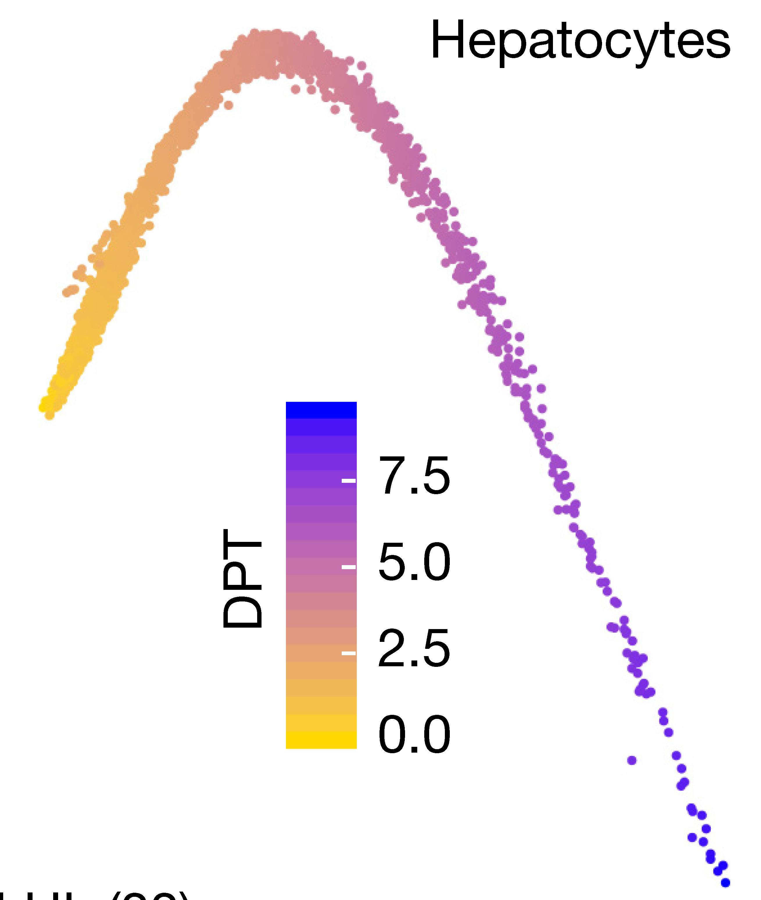
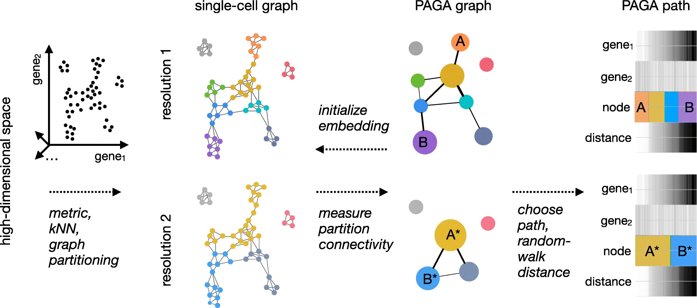
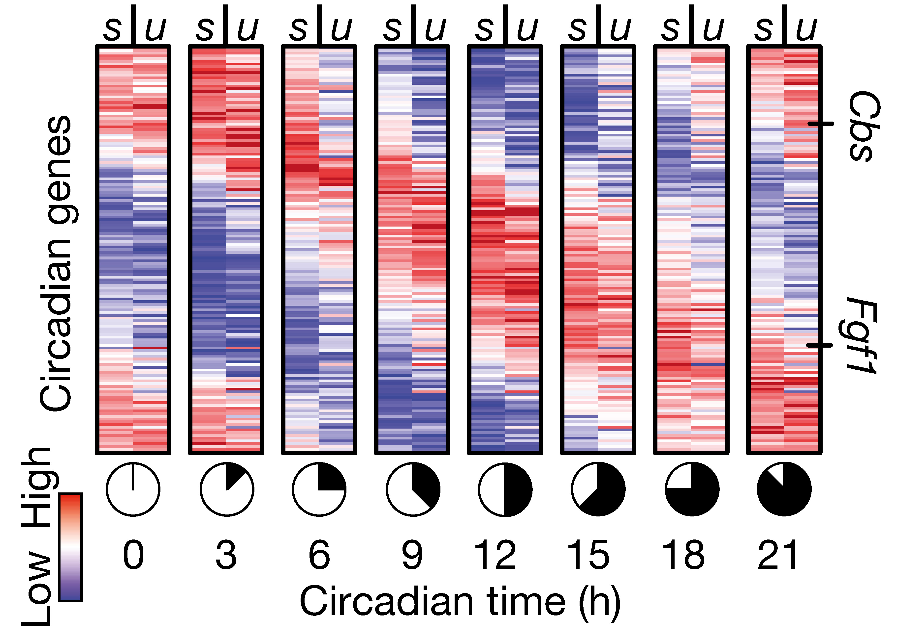

```{r setup, include=FALSE}
knitr::opts_chunk$set(
  echo      = TRUE,
  cache     = TRUE,
  message   = FALSE,
  warning   = FALSE,
  comment   = "#>",
  fig.align = "center"
)
```


## Trajectory inference, aka pseudotime*

Assumes that cells are sampled during various stages of a transition from a cell type or state to another type or state. By identifying trajectories that connect cells based on similarilty in gene expression, one can gain insights into lineage relationships and developmental trajectories. Often called pseudotime, but doesn't have to relate to cells in different times in a process (could be spatial differences). 

Analysis of discrete clusters can hide interesting continous behaviors in cell populations. By ordering cells based on up an expression trajectory one can uncover novel patterns of gene expression. 

* pseudo-science?

## There are many methods


```{r}
knitr::include_graphics("img/dynverse.webp")
```

Check out the [`dynverse`](https://dynverse.org/) for help with algorithm selection. They benchmarked > 60 methods, and offer some tools to run multiple algorithms on the same data. 


## Simplest method (PCA)

In some datasets, particularly developmental datasets it is often the case that a principal component may separate out cells based on known developmental time. This can be used a "pseudotime" metric, which is simply the PC1 scores for each cell. As an example, scRNA-seq analyses of [liver development](http://dx.doi.org/10.1038/nature22796) and [Beta-cell maturation](http://dx.doi.org/10.1016/j.cmet.2017.04.014) used PC1 to examine pseudotime. 

```{r pkgs}
library(Seurat)
library(tidyverse)
library(Matrix)
library(slingshot)
library(monocle3)
library(SingleCellExperiment)
library(RColorBrewer)
library(gam) #install.packages("gam")
library(cowplot)

theme_set(theme_cowplot())
```

For this first analysis we will use a dataset of mouse early embryogenesis that was curated into a SingleCellExperiment object from here
https://hemberg-lab.github.io/scRNA.seq.datasets/. 

```{r}
# read in data
sce <- readRDS(url("https://scrnaseq-public-datasets.s3.amazonaws.com/scater-objects/deng-reads.rds"))

# convert SingleCellExperiment to Seurat
# already log normalized
sobj <- as.Seurat(sce)
sobj <- FindVariableFeatures(sobj)
sobj <- ScaleData(sobj)
sobj <- RunPCA(sobj, verbose = FALSE)

Idents(sobj) <- "cell_type1"
DimPlot(sobj, reduction = "pca")
```


Next we will plot out the PC1 scores for each cell type (developmental stage), using the meta data stored in the `cell_type` column of `meta.data`. 

```{r}
plt_dat <- FetchData(sobj, c("PC_1", "cell_type1"))

# reorder cell_type based on known developmental time
cell_type <- factor(plt_dat$cell_type1,
                            levels = c("zygote",
                                       "2cell",
                                       "4cell",
                                       "8cell",
                                       "16cell",
                                       "blast"))
plt_dat$cell_type <- cell_type

ggplot(plt_dat, aes(cell_type, PC_1)) +
  geom_jitter(aes(color = cell_type)) +
  labs(y = "PC1 (aka pseudotime)")

```


EXERCISE: Identify genes that are highly correlated (positive or negative) with PC1 using a seurat function. Then plot the expression of some of these genes against Pseudotime ("PC1" x-axis, gene expression y-axis), using either built in seurat plotting functions or ggplot2. 

<br>


<br>


```{r, eval = FALSE, echo = FALSE}
VizDimLoadings(sobj, dims = 1, balanced = T)

FeatureScatter(sobj, "PC_1", "Actb")
FeatureScatter(sobj, "PC_1", "Pde3b")
FeatureScatter(sobj, "PC_1", "Pou2f2")
```


We can overlay the pseudotime scores onto a projection by storing them as a meta.data column. 

```{r}
sobj <- RunUMAP(sobj, dims = 1:15)

# get PC1 values and rank to generate a "pseudotime"
ptime <- FetchData(sobj, "PC_1")
ptime$ptime <- rank(ptime$PC_1)

# add to metadata
sobj <- AddMetaData(sobj, 
                    ptime$ptime, 
                    col.name = "Pseudotime")

FeaturePlot(sobj, "Pseudotime")
DimPlot(sobj, 
        group.by  = "cell_type1", 
        reduction = "umap")
```


## Destiny

Non-linear dynamics are not always captured by PCA, an alternative approach uses non-linear transformations, such as diffusion maps (or ICA, or others).


```{r, echo = FALSE}


```

```{r}
library(destiny)

logcounts <- GetAssayData(sobj, "data")

# transpose matrix (genes as columns, cells as rows)
input_matrix <- t(logcounts[VariableFeatures(sobj), ])

dm <- DiffusionMap(input_matrix)

plot(dm, 1:2, col = sobj$cell_type1)
```


Next we calculate diffusion pseudotime using `DPT`.  


```{r}
dpt <- DPT(dm, tips = 268)
plot(dpt, 1:2)

tmp <- data.frame(DC1 = dm$DC1,
                  DC2 = dm$DC2,
                  timepoint = cell_type,
                  dpt = dpt$DPT1)

ggplot(tmp, aes(x = DC1, 
                y = DC2, 
                colour = timepoint)) +
    geom_point() + scale_color_brewer(palette = "Paired") + 
    xlab("Diffusion component 1") + 
    ylab("Diffusion component 2") +
    theme_classic()
```


```{r}

ggplot(tmp, aes(timepoint, dpt, 
                colour = timepoint)) +
  geom_point() + 
  geom_jitter() +
  scale_color_brewer(palette = "Paired") 
```

PCA and diffusion maps can be good for simple trajectories or pathway activation systems e.g. T-cell activation, drug pertubation, single cell type responses. 

## Slingshot 

For more complex trajectories, simply using a single PC or a diffusion componenet may not be sufficient. Systems with bi or tri-furcating trajectories won't be well fit within a single dimension. 

For this next analysis we will use a dataset taken from a single cell RNA-seq study of [hepatocyte development](https://doi.org/10.1002/hep.29353). 

```{r}
dl_url <- "https://scrnaseq-workshop.s3-us-west-2.amazonaws.com/GSE90047_TPMS.tsv.gz"

mat <- read_tsv(dl_url) %>% 
  as.data.frame()

# set rownnames on matrix
rownames(mat) <- mat$gene
mat[, 1] <- NULL

# convert to sparseMatrix
mat <- as(as.matrix(mat), "sparseMatrix")

# generate metadata from cell names
mdata <- tibble(cell = colnames(mat)) %>% 
  separate(cell, c("timepoint", "other", "num"), 
           sep = "_", remove = FALSE) %>% 
  tibble::column_to_rownames("cell")


so <- CreateSeuratObject(mat, meta.data = mdata)

# Normalize data by log transforming raw TPMs
log_mat <- log1p(GetAssayData(so, "data"))
so <- SetAssayData(so, "data", new.data = log_mat) 

```

EXERCISE: Process this data through clustering and UMAP projections using `Seurat` (using defaults should be fine). Plot PC1 and PC2 in a `DimPlot`

<br>

<br>


```{r, echo = FALSE}
so <- FindVariableFeatures(so)
so <- ScaleData(so)
so <- RunPCA(so, verbose = FALSE)
so <- RunUMAP(so, dims = 1:20)
so <- FindNeighbors(so)
so <- FindClusters(so, resolution = 1.0, verbose = FALSE)

DimPlot(so, group.by = "timepoint", reduction = "pca")
DimPlot(so, reduction = "pca")
```


[Slingshot](https://bmcgenomics.biomedcentral.com/articles/10.1186/s12864-018-4772-0) is a [Bioconductor package](https://bioconductor.org/packages/release/bioc/html/slingshot.html) that draws curved trajectories through a low dimensional embedding to infer developmental dynamics. It provides functionality for computing pseudotimes through multiple trajectories.


```{r, echo = FALSE}
knitr::include_graphics("img/slingshot.png")
```

<br>

<br>

```{r}
#convert to SingleCellExperiment
sce <- as.SingleCellExperiment(so)

#subset to only a few PCA dimensions
reducedDim(sce) <- reducedDim(sce)[, 1:10]

sce <- suppressWarnings(slingshot(
  sce,
  reducedDim = 'PCA',
  clusterLabels = 'seurat_clusters',
  start.clus = "4"
))

# extract info about pseudotimes from sce
slo <- SlingshotDataSet(sce)

slo
```


slingshot provides some minimal plotting utilities in base R plotting. 


```{r}

# Plot clusters with lineages overlayed
plot(reducedDims(sce)$PCA, col = brewer.pal(9,'Set1')[sce$seurat_clusters], pch=16)
lines(SlingshotDataSet(sce), lwd=2, col='black')


# Plot pseudotime for a lineage
# get colors for pseudotime from lineage 1
colors <- colorRampPalette(brewer.pal(11,'Spectral')[-6])(100)
plotcol <- colors[cut(sce$slingPseudotime_2, breaks=100)]

plot(reducedDims(sce)$PCA, col = plotcol, pch=16)
lines(SlingshotDataSet(sce), lwd=2, col='black')

```


Here's some code to help with plotting these data in ggplot2.

```{r, eval = FALSE}

#' function to add curve data to SingleCellObject metadata
add_curves <- function(sce, lineage = 2){
  curve_data <- slingCurves(sce)[[lineage]]
  curve_pos <- curve_data$s[curve_data$ord, 1:2]
  
  sce[[paste0("curve", lineage, "_x")]] <- curve_pos[, 1]
  sce[[paste0("curve", lineage, "_y")]] <- curve_pos[, 2]
  sce
}

#' function to extract out metadata and reduced dimension data for plotting
get_plotting_data <- function(sce, reduction = "PCA"){
  pcs <- reducedDims(sce)[[reduction]][, 1:2]
  mdata <- colData(sce) %>% 
    as.data.frame() 
  df <- cbind(mdata, pcs)
  df
}


sce <- add_curves(sce, lineage = 1)
sce <- add_curves(sce, lineage = 2)
plot_df <- get_plotting_data(sce)


ggplot(plot_df, aes(PC_1, PC_2)) +
  geom_point(aes(color = slingPseudotime_2)) +
  geom_point(aes(curve1_x, curve1_y)) +
  geom_point(aes(curve2_x, curve2_y)) 

ggplot(plot_df, aes(PC_1, PC_2)) +
  geom_point(aes(color = timepoint)) +
  geom_point(aes(curve1_x, curve1_y)) +
  geom_point(aes(curve2_x, curve2_y)) 
```


### plotting slingshot pseudotime onto UMAP

The lineage trees are generated in the same dimensionality as the input data. To visualize the pseudotime estimates in UMAP space we can add these to the meta.data slot of the seurat object. 

```{r}
so$pseudotime1 <- sce$slingPseudotime_1
so$pseudotime2 <- sce$slingPseudotime_2
FeaturePlot(so, c("pseudotime1", "pseudotime2"))
```


## Identifying differentially expressed genes along a trajectory

We can use a `GAM` (or other models) to compare pseudotimes to gene expression values to identify genes that vary significantly with pseudotime. Using a GAM can uncover non-linear expression patterns (i.e. not just up or down). See this [blog](https://multithreaded.stitchfix.com/blog/2015/07/30/gam/) for a nice description. 

```{r}
# select the ptime values 
ptime <- sce$slingPseudotime_2

# get cells in that lineage
lineage_cells <- colnames(sce)[!is.na(ptime)]

# remove values for cells not in the lineage
ptime <- ptime[!is.na(ptime)]

# just test variable genes to save some time
genes_to_test <- VariableFeatures(so)[1:1000]

# get log normalized data to test
cnts <- logcounts(sce)[genes_to_test, lineage_cells]


# fit a GAM with a loess term for pseudotime
gam.pval <- apply(cnts, 1, function(z){
    d <- data.frame(z = z, 
                    ptime = ptime)
    tmp <- suppressWarnings(gam(z ~ lo(ptime), data=d))
    p <- summary(tmp)[4][[1]][1, 5]
    p
})

# adjust pvalues 
res <- tibble(
  id = names(gam.pval),
  pvals = gam.pval,
  qval = p.adjust(gam.pval, method = "fdr")) %>% 
  arrange(qval)

head(res)

```


Finally make a heatmap to plot out these genes that vary over pseudotime.

```{r, fig.height = 6}

# get log normalized counts 
to_plot <- as.matrix(logcounts(sce)[res$id[1:100], lineage_cells])

# arrange cells by pseudotime
ptime_order <- colnames(to_plot)[order(ptime)]

# add useful annotations
annotations <- colData(sce)[lineage_cells, 
                            c("slingPseudotime_2", 
                            "seurat_clusters", 
                            "timepoint")] %>% 
  as.data.frame()

ha <- HeatmapAnnotation(df = annotations)

Heatmap(to_plot,
        column_order = ptime_order,
        show_column_names = FALSE,
        show_row_names = FALSE,
        top_annotation = ha)
```


## Extremely (perhaps overly) complex, monocle3:

[monocle3](https://cole-trapnell-lab.github.io/monocle3/) is the newest release of the monocle package from Cole Trapnell's lab. It can handle million cell scale datasets and highly complex trajectories.

```{r}
expression_matrix <- readRDS(url("http://staff.washington.edu/hpliner/data/packer_embryo_expression.rds"))
cell_metadata <- readRDS(url("http://staff.washington.edu/hpliner/data/packer_embryo_colData.rds"))
gene_annotation <- readRDS(url("http://staff.washington.edu/hpliner/data/packer_embryo_rowData.rds"))

cds <- new_cell_data_set(expression_matrix,
                         cell_metadata = cell_metadata,
                         gene_metadata = gene_annotation)
```


```{r}
# subset to 2000 cells
set.seed(42)
ids <- sample(colnames(cds), 2000)
cds <- cds[, ids]
```

monocle3 relies on performing some steps that are also performed by Seurat. For this reason it doesn't play very well with Seurat, so we follow their preprocessing steps to normalize, run PCA, and run UMAP. 

We will use example data from the monocle3 tutorial. Note that the `preprocess_cds` function can take covariates to regress out. The variables shown here were used for background RNA removal in the original publication.   

```{r}
# run normalization and PCA
cds <- preprocess_cds(cds, 
                      num_dim = 100,
                      residual_model_formula_str = "~ bg.300.loading + bg.400.loading + bg.500.1.loading + bg.500.2.loading + bg.r17.loading + bg.b01.loading + bg.b02.loading")

# run UMAP
cds <- reduce_dimension(cds)

plot_cells(cds, 
           label_groups_by_cluster=FALSE,  
           color_cells_by = "cell.type")

# cluster cells using similar algorithm to seurat
cds <- cluster_cells(cds)

plot_cells(cds, color_cells_by = "partition")
plot_cells(cds, color_cells_by = "cluster")
```

We will next generate a graph that weaves through the data. This algorithm is related to the approach used in the python package `PAGA` that we will discuss later.

```{r}
cds <- learn_graph(cds)

plot_cells(cds,
           color_cells_by = "cell.type",
           label_groups_by_cluster = FALSE,
           label_leaves = FALSE,
           label_branch_points = FALSE)

plot_cells(cds,
           color_cells_by = "embryo.time.bin",
           label_cell_groups = FALSE,
           label_leaves = TRUE,
           label_branch_points = TRUE,
           graph_label_size = 1.5)

```

Next we will select the root cells to compute pseudotimes. monocle3 provides an interactive shiny interface to select cells. 

```{r, eval = FALSE}
cds <- order_cells(cds)

plot_cells(cds,
           color_cells_by = "pseudotime",
           label_cell_groups=FALSE,
           label_leaves=FALSE,
           label_branch_points=FALSE,
           graph_label_size=1.5)
```

We can test for genes that are significantly coclustered using the `graph_test`. This can identify genes that change along a trajectory.

```{r eval = FALSE}
de_genes = graph_test(cds,
                      neighbor_graph = "principal_graph",
                      cores = 4)
                               
de_genes = row.names(subset(de_genes, q_value < 0.05))

plot_cells(cds, genes=de_genes[1:4],
           show_trajectory_graph=FALSE,
           label_cell_groups=FALSE,
           label_leaves=FALSE)
```

To more specifically examine a single lineage or branch, we can subset the data interactively and recompute differential expression.

```{r, eval = FALSE}
cds_subset <- choose_cells(cds)

de_genes <- graph_test(cds_subset, cores = 4)
de_ids <- rownames(subset(de_genes, q_value < 0.05))

plot_cells(cds_subset,
           genes = de_ids[1:6],
           label_cell_groups=FALSE,
           show_trajectory_graph=FALSE)
       
```

## PAGA

[PAGA](https://genomebiology.biomedcentral.com/articles/10.1186/s13059-019-1663-x) is a python module available in the python counterpart to seurat known as `scanpy`. `PAGA` provides both a very nice visualization technique, and a method for trajectory analysis.

```{r, echo = FALSE}

```
<br>

<br>


```{r, echo = FALSE}
knitr::include_graphics("img/paga_graph.png")
```

## How to deal with multiple timepoints

[URD](https://github.com/farrellja/URD)
[STITCH](https://github.com/wagnerde/STITCH)
[Waddington-OT](https://broadinstitute.github.io/wot/)

```{r, echo = FALSE}
knitr::include_graphics("img/urd.jpg")

```


## RNA velocity

Has a python and R package implementation for performing analysis. Requires processing bam file to quantitate unspliced and spliced mRNAs per cell. 

http://velocyto.org/

https://github.com/velocyto-team/velocyto.R

```{r, echo = FALSE}

```


```{r, echo = FALSE}
knitr::include_graphics("img/rna_velo.jpg")
```

## Recommendations:

1) Limit analysis to relevant cell populations (i.e. don't try to infer trajectories where you know they don't exist)

2) Start with simple methods and trajectories. 

3) Complement pseudotime trajectories with RNA velocity analyses to provide directionality and orthogonal validation. 

## Credits:

Much of this material was either copied or motivated by the `slingshot`, `destiny`, and `monocle3` vignettes. 
