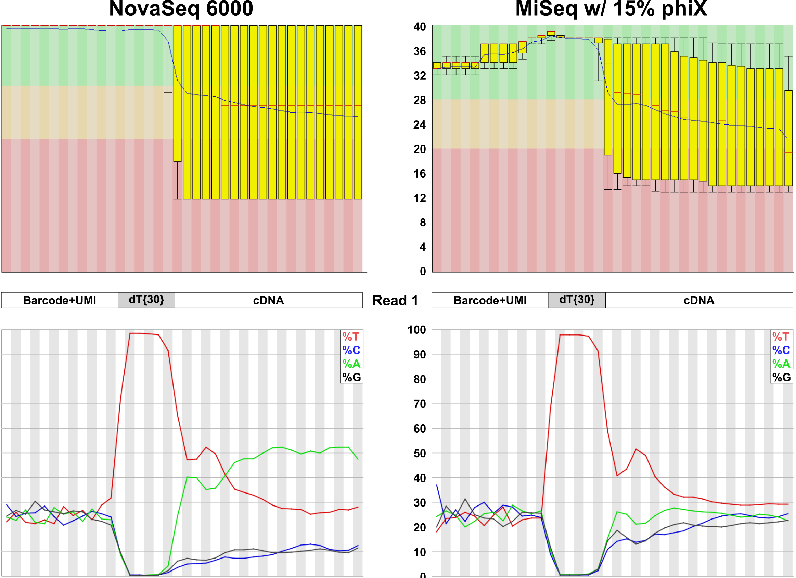
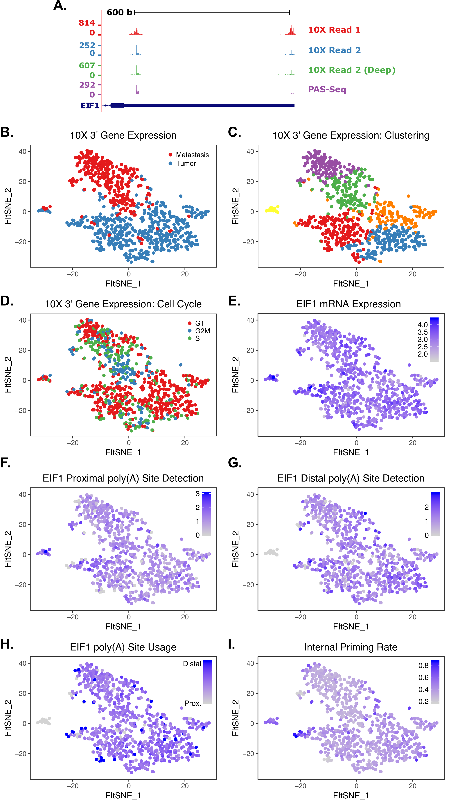
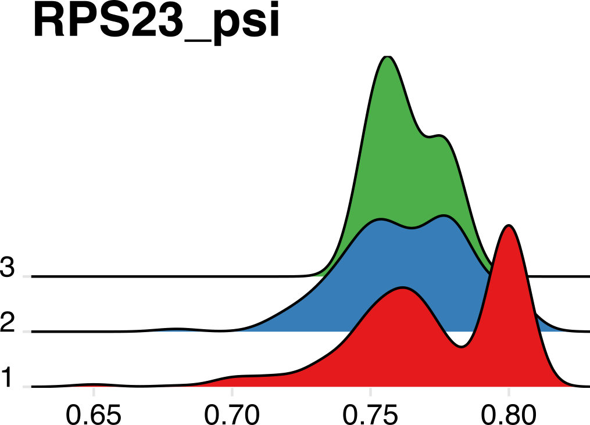
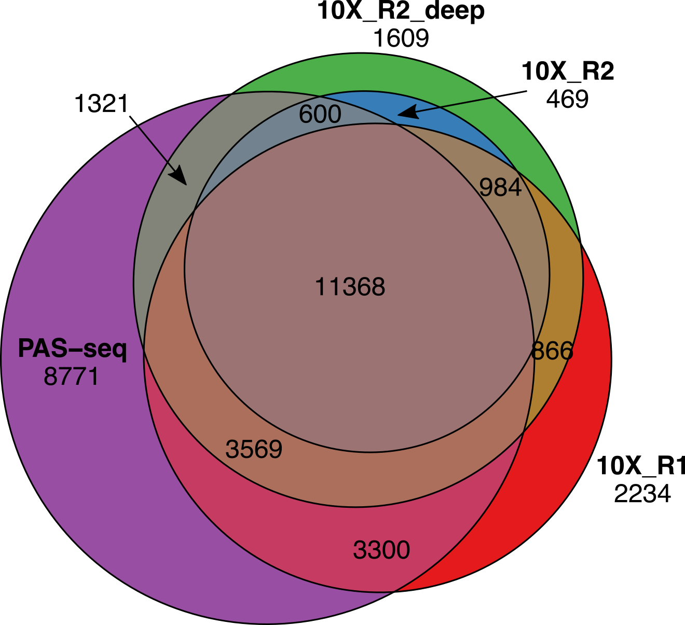

```{r pkgs, include=FALSE}
library(Seurat)
library(tidyverse)
library(cowplot)

knitr::opts_chunk$set(
  message   = FALSE,
  warning   = FALSE,
  echo      = TRUE,
  comment   = "#>",
  fig.align = "center"
)
```

# Imputation (and other resources)

- Zeros in single cell expression matrices have two sources: technical and biological.
- Several recently developed approaches can model the difference between biological and technical zeros and impute expression values for only technical zeros.
- The most difficult thing about imputation is deciding when - or more importantly, when _not_ - it is appropriate to use.
- As a general rule, imputation should be restricted to visualization and expression filtering and _not_ used for differential expression or dimensionality reduction/clustering.

## Packages covered:

1) ALRA (https://github.com/KlugerLab/ALRA)
2) scRecover (https://bioconductor.org/packages/release/bioc/html/scRecover.html)
3) enImpute (https://github.com/Zhangxf-ccnu/EnImpute)

## Back to our pancreatic islet datasets

The code below downloads a Seurat object that contains the celseq2 human pancreatic islet cell data that we used yesterday and plots common markers of alpha, beta, delta and gamma cells (all other populations have been removed). Note that while the alpha and beta cell markers are robustly detected, the delta and gamma cell markers are more sparse.

```{r pancreas_data, fig.height=12, fig.width=10}
so <- readRDS(gzcon(url("https://scrnaseq-workshop.s3-us-west-2.amazonaws.com/pancreas_celseq2.Rds")))

pre_cell_plot <- DimPlot(so,
                         reduction = "umap",
                         group.by = "celltype")

#  IRX2 = alpha cells, MAFA = beta cells, PSIP1 = delta cells, MEIS2 = gamma (PP) cells
pre_marker_plot <- FeaturePlot(so,
                         c("IRX2",
                           "MAFA",
                           "PSIP1",
                           "MEIS2"))

plot_grid(pre_cell_plot,
          pre_marker_plot,
          ncol = 1)
```

## Integrated into Seurat: ALRA


ALRA performs "zero-preserving" imputation by (1) computing the rank-k approximation for the expression matrix using randomized SVD (Singular Value Decomposition), (2) thresholding each row (gene) by the magnitude of the most negative value of that gene, and (3) rescaling the matrix.

### Running ALRA on a Seurat object

ALRA is packaged with Seurat v3 (`RunALRA()`). Here, we run ALRA with the default parameters. ALRA reports some very interesting metrics during the run, most notably the proportion of non-zero counts in the matrix before and after imputation. ALRA creates a new assay slot that contains the imputed data.

```{r alra}
# by default, ALRA is set as the default assay (poor form)
so <- RunALRA(so,
              setDefaultAssay = FALSE)

# a new assay called 'alra' now appears in the object
so@assays$alra
```

We can now access the alra imputed matrix from any Seurat plotting function using the "alra_" prefix.

For robustly detected genes, such as the alpha and beta cell markers, little change is observed. However, expression of the the delta and gamma cell markers is now uniformly high in the relevant clusters.

```{r alra_plots, fig.height=12, fig.width=10}
robust_alra_plot <- FeaturePlot(so,
                         c("rna_IRX2",
                           "alra_IRX2",
                           "rna_MAFA",
                           "alra_MAFA"),
                         combine = TRUE)

weak_alra_plot <- FeaturePlot(so,
                         c("rna_PSIP1",
                           "alra_PSIP1",
                           "rna_MEIS2",
                           "alra_MEIS2"),
                         combine = TRUE)

plot_grid(robust_alra_plot,
          weak_alra_plot,
          nrow = 2)
```

## More flexible: scRecover


Unlike ALRA, scRecover is not an imputation method per se, but rather a method for identifying dropouts (technical zeros) using a zero-inflated negative binomial model. scRecover can be paired with any of several imputation methods (scImpute, SAVER, MAGIC) that do not themselves handle dropouts well to impute only dropouts. The plots above demonstrate the performance improvement on a downsampled dataset. The downside of scRecover is that is requires either _a priori_ clustering or a fixed number of expected clusters as input.

### Running scRecover

scRecover can be run directly on SingleCellExperiment objects, but not Seurat objects. As a result, it's easier to supply the normalized counts matrix and the clustering information than to coerce our Seurat object to a SCE object. scRecover is slow, so we won't run it interactively here. It can be parallelized, but not in RStudio (for completely arbitrary reasons). By default, scRecover uses scImpute for the actual imputation.

```{r screcover, eval = F}

# by default, ALRA is set as the default assay (poor form)
scRecover(as.matrix(so@assays$RNA@data), # the sparse matrix must be coerced to a matrix
          labels = so@meta.data$celltype,
          outputDir = "./outDir_scRecover/") # scRecover does not return an R object, but instead writes results to the indicated directory

# we can read in the resulting corrected matrix and add it to our Seurat object as a new assay
scr.adt <- as.sparse(read.csv(file = "./outDir_scRecover/scRecover+scImpute.csv", sep = ",", 
    header = TRUE, row.names = 1, check.names = F))

# base R functions used by scRecover mess up our cell names...
colnames(scr.adt) <- gsub("\\.",
                          "-",
                          colnames(scr.adt))

so[["scr"]] <- CreateAssayObject(counts = scr.adt)
```

As with ALRA, we can access the new assay Seurat plotting function using the "scr_" prefix.

The imputation results are similar to ALRA, but generally more conservative with default values.

```{r screcover_plots, fig.height=24, fig.width=10, eval = F}
robust_scr_plot <- FeaturePlot(so,
                         c("rna_IRX2",
                           "scr_IRX2",
                           "rna_MAFA",
                           "scr_MAFA"),
                         combine = TRUE)

weak_scr_plot <- FeaturePlot(so,
                         c("rna_PSIP1",
                           "scr_PSIP1",
                           "rna_MEIS2",
                           "scr_MEIS2"),
                         combine = TRUE)

plot_grid(robust_scr_plot,
          weak_scr_plot,
          nrow = 2)
```

This difference highlights the strengths and weaknesses of both approaches - ALRA aggressively imputes expression in closely related cells but leaves most cells untouched, while scRecover imputes expression more conservatively in cells modeled to have experienced dropout of a given gene.

```{r impute_plots, fig.height=12, fig.width=10, eval = F}
FeaturePlot(so,
            c("alra_PSIP1",
              "scr_PSIP1",
              "alra_MEIS2",
              "scr_MEIS2"),
            combine = TRUE)
```

## Imputing dropouts via ensemble learning: enImpute

https://github.com/Zhangxf-ccnu/EnImpute

EnImpute combines the results obtained from multiple imputation methods - including ALRA, scImpute, SAVER, and MAGIC - to (allegedly) generate a more accurate result. It's a bit complicated to install, and ALRA/scRecover work well, so it's mentioned here only for infromational purposes.

## Single cell CNV Inference: InferCNV


Copy number variation can be inferred (reasonably successfully) using binned expression patterns across genomic regions. These data can be used to confirm that sequenced cells are actually neoplastic by comparison with traditional CNV data, cluster clonal cell populations, and identify potential novel CNVs. InferCNV works best with full-length single cell technologies (smart-seq2, etc.), but usable results can be obtained with 10X data. Not surprisingly, sufficient sequencing depth is crucial.

## SNP calling: 

SNPs can also be called using single cell RNA-seq, but the utility of this approach is severely limited by the depth and 3' bias (particularly in the case of 10X data).

10X has a github repo with code to call SNPs (https://github.com/10XGenomics/single-cell-3prime-snp-clustering), but it hasn't been updated in a couple of years. Nonetheless, the methodology is sound.

## Sample demultiplexing by SNP: demuxlet

If you have _known_ genetic variation in your samples, a package called demuxlet (https://github.com/statgen/demuxlet) can effectively demultiplex pooled samples without the need for antibody barcoding/hashing. Using simulated data, the authors have shows that 50 single-nucleotide polymorphisms (SNPs) per cell are sufficient to assign 97% of singlets and identify 92% of doublets in pools of up to 64 individuals. The caveat is that those 50 SNPs need to be in the limited sequence space captured by the 10X assay.

## V(D)J Sequencing: Available tools

T cell receptor (TCR) and B cell receptor (BCR) sequencing works quite well on the 10X platform. Unfortunately, the only viable non-custom analysis platform is currently 10X's own V(D)J Loupe Browser. Oddly, Cell Ranger does not even provide functionality to aggregate V(D)J results (which would be useful to easily identify shared clonotypes across samples). 

## 3' end mapping in single cells


10X Genomics libraries are "TVN" primed, and as such include mRNA 3' end data that is not utilized in any current pipelines. We have developed an approach (implemented in rudimentary fashion in the scraps repo above) to extract 3' end data from these libraries. The principle is schematized below with the bulk PAS-seq method for comparison.


The primary reason that these data are usually discarded is that most Illumina basecallers cannot handle the poly(T) stretch that separates the cell barcode from the single-base resolution 3' end data in Read 1. FASTQC plots below illustrate the problem.



Despite this limitation, satisfactory results can also be obtained from Read 2 (the read normally mapped for gene counting). While it is not as useful as Read 1 data, it can still be extremely informative. In addition to 3' end mapping data, these reads can also be used to measure the internal priming rate in 10X libraries. Somewhat surprisingly, it appears to average nearly 40%! This isn't entirely surprising, given that RNA Velocity analysis "works".


The data - even from read 2 - is robust enough to observe APA events in single cells. The tSNE plots below show variable poly(A) site selection in the EIF1 gene in breast cancer.



We can also observe APA events in response to treatment in AML. Below are two ridge plots that show a restriction in poly(A) site heterogeneity after treatment ("2" and "3") compared to pre-treatment samples ("1").




As one final confirmation, we can see that bulk poly(A) sites identified by PAS-seq and both 10X reads overlap significantly, validating the approach in single cells.




We are in the process of writing up a manuscript describing this approach, and will be eventually develop scraps into a full-featured package.