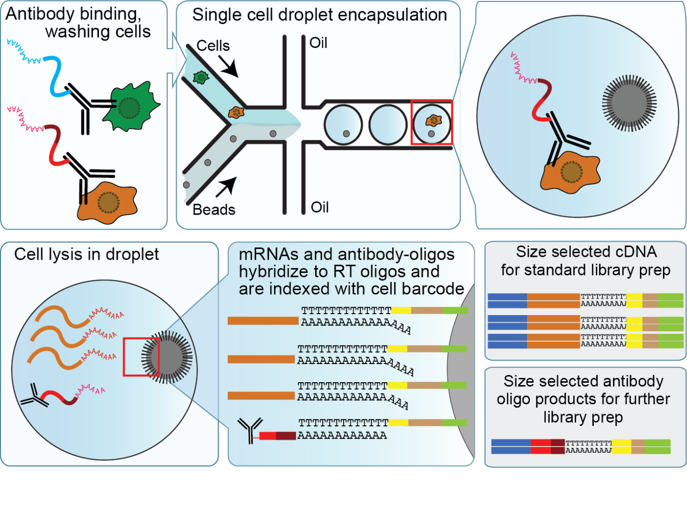
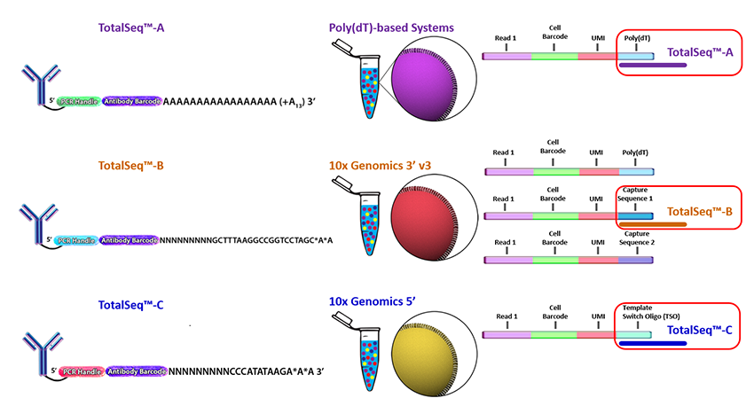
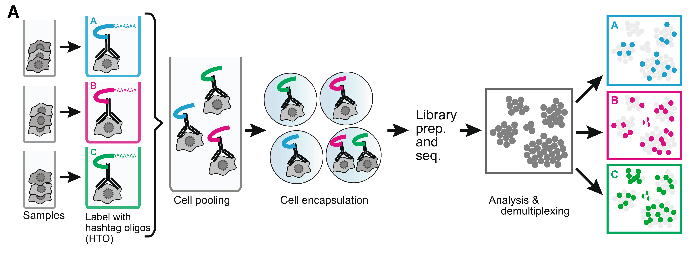

```{r setup, include = FALSE}
knitr::opts_chunk$set(
  message     = FALSE,
  warning     = FALSE,
  echo        = TRUE,
  engine.opts = list(bash= "-l"),
  comment     = "#>",
  fig.align   = "center"
)

library(Seurat)
library(tidyverse)
library(cowplot)
```

## Experimental design

### CITE-seq enables detection of cell surface proteins AND gene expression



### CITE-seq reagents

Biolegend is the main company selling CITE-seq and cell hashing antibodies ([TotalSeq](https://www.biolegend.com/en-us/totalseq)). Biolegend reagents are divided into three product lines:

* TotalSeq-A: 3' gene expression, v2 and v3 chemistry
* TotalSeq-B: 3' gene expression, v3 chemistry 
* TotalSeq-C: 5' gene expression and V(D)J



### Cell hashing reagents

[Cell hashing](https://genomebiology.biomedcentral.com/articles/10.1186/s13059-018-1603-1) allows for sample multiplexing and "super-loaded" runs with >10,000 captured cells. Super-loading results in higher doublet rates (~10% for 10,000 captured cells), but these doublets can be removed by identifying cell barcodes that are associated with multiple hashtag oligos.



Biolegend cell hashing reagents for human cells include a mix of two antibodies that recognize CD298 and β2 microglobulin. Mouse hashing antibodies recognize CD45 and H-2 MHC class I.

TotalSeq-A reagents use a different PCR handle for CITE-seq and cell hashing antibodies. This means two separate libraries have to be prepared. To ensure that the correct libraries are created, it is import to tell the sequencing core which types of antibodies were included in the experiment.

TotalSeq-C reagents use the same PCR handle for CITE-seq and cell hashing antibodies, which means that only a single library will be prepared. However, to ensure that the correct libraries are created the core should be notified of all reagents used for the experiment.

[MULTI-seq](https://www.nature.com/articles/s41592-019-0433-8) uses lipid- and cholesterol-modified oligonucleotides.

<br>

## Creating a Seurat object with multiple assays

### Loading counts matrices

The `Read10X` function can be used with the output directory generated by Cell Ranger. However, public datasets can be formatted in many different ways, so it is very useful to become familar with converting between formats.  Our UMI count data is stored as comma-separated files, which we can load as data.frames and then convert to sparse matrices. 

Our data today will be a collection of 4 PBMC samples that have each been "hashed" with different cell-hashtags, stained with 8 different CITE-seq antibodies, then combined and captured on the 10x platform in 1 sample. 

We have three files that we will work with:

* CITEseq_cDNA.csv.gz: UMI count gene expression data
* CITEseq_ADT.csv.gz: Antibody count data
* CITEseq_HTO.csv.gz: Hashtag count data

```{r "Load data"}
# Data URL
data_url <- "https://scrnaseq-workshop.s3-us-west-2.amazonaws.com"

# Function to import counts
import_counts <- function(file_name, file_url = data_url) {
  mtx <- file.path(file_url, file_name) %>%
    read_csv() %>%
    column_to_rownames(colnames(.[, 1])) %>%
    as.sparse()

  mtx
}

# Import gene expression matrix
rna_mtx <- import_counts("CITEseq_cDNA.csv.gz")

# Import CITE-seq matrix
adt_mtx <- import_counts("CITEseq_ADT.csv.gz")

rownames(adt_mtx) <- str_c("adt-", rownames(adt_mtx))
adt_mtx[, 1:10]

# Import HTO matrix
hto_mtx <- import_counts("CITEseq_HTO.csv.gz")

hto_mtx[, 1:10]
```

### Creating a Seurat object

When adding multiple assays to a Seurat object, we first must identify cell barcodes that are present in all of the datasets. If one of the assays has a different number of cell barcodes Seurat will throw an error.

```{r "Create Seurat object"}
# Get list of common cell barcodes
rna_bcs <- colnames(rna_mtx)
adt_bcs <- colnames(adt_mtx)
hto_bcs <- colnames(hto_mtx)

merged_bcs <- rna_bcs %>%
  intersect(adt_bcs) %>%
  intersect(hto_bcs)

# Create Seurat object
sobj <-  CreateSeuratObject(
  counts    = rna_mtx[, merged_bcs], 
  min.cells = 5
)

# Add CITE-seq and cell hashing data to Seurat object
sobj[["ADT"]] <- CreateAssayObject(adt_mtx[, merged_bcs])

sobj[["HTO"]] <- CreateAssayObject(hto_mtx[, merged_bcs])
  
sobj
```

<br>

## Demultiplexing hashed samples

We will first use the cell hashing data to assign cells to their sample of origin. This is referred to as demultiplexing as we are using the cell hashing antibody barcodes to assign each cell to a sample. 

### Normalizing HTO counts

To account for differences in antibody binding efficiency, CITE-seq and cell hashing data can be normalized by performing a centered log-ratio transformation for each individual antibody.

Note that the best approach for normalizing CITE-seq data has not been settled. For a more detailed discussion, and alternative approaches, see the Normalization chapter from the [Orchestrating Single Cell Analysis eBook](https://bioconductor.org/books/release/OSCA/integrating-with-protein-abundance.html#normalization-1) from Bioconductor.

```{r "Normalize HTO counts"}
# Normalize HTO counts
sobj <- sobj %>%
  NormalizeData(
    assay = "HTO",
    normalization.method = "CLR"
  )
```

### Sample demultiplexing and identification of doublets

To demultiplex hashed samples, the `HTODemux` function uses the normalized HTO counts for k-medoids clustering. This results in a cluster for each HTO. A background signal is then calculated for each HTO using cells that are not present in the HTO-specific cluster. Outlier cells from this background signal are then classified as being "positive" for the HTO if they are above a cutoff quantile value (~97% of background).

Cells that are positive for multiple HTOs are classified as doublets and cells that are not positive for any HTO are classified as "negative" cells.

The `HTODemux` function automatically adds several columns to the meta.data table. 

* HTO_classification: shows positive HTOs that were identified for the cell
* HTO_classification.global: singlet classification (singlet, doublet, negative)
* hash.ID: final HTO assignment including doublet and negative classifications

```{r "Demultiplex samples", fig.width = 11, fig.height = 8}
# Demultiplex samples
# By default HTODemux will look for the "HTO" assay
sobj <- sobj %>%
  HTODemux(positive.quantile = 0.97)

head(sobj@meta.data)

# Summarize cell classifications
table(sobj$HTO_classification.global)

# Create ridge plots showing HTO signal
sobj %>%
  RidgePlot(
    assay    = "HTO",
    features = rownames(hto_mtx),
    ncol     = 2
  )
```

### Compare the number of cells with each hash.ID and calculate the doublet rate

```{r fig.width = 9, fig.height = 5, echo = FALSE}
# Calculate doublet rate
sobj@meta.data %>%
  group_by(hash.ID) %>% 
  summarize(
    n     = n(),
    fract = n / nrow(.)
  )

# Create bar graphs comparing cell count for each sample
dat <- sobj@meta.data %>%
  rownames_to_column("cell_id")

hto_theme <- cowplot::theme_cowplot() +
  theme(
    legend.position = "none",
    axis.title.x    = element_blank(),
    axis.text.x     = element_text(hjust = 1, angle = 45)
  )

bars_1 <- dat %>%
  ggplot(aes(hash.ID, fill = hash.ID)) +
  geom_bar() +
  labs(y = "cell count") +
  hto_theme

bars_2 <- dat %>%
  ggplot(aes("PBMC", fill = hash.ID)) +
  geom_bar() +
  labs(y = "cell count") +
  hto_theme +
  theme(legend.position = "right")

# Combine plots
plot_grid(
  bars_1, bars_2,
  align       = "h",
  nrow        = 1,
  rel_widths  = c(1, 0.6)
)
```

<br>

## Filtering data and assessing quality

Now that we have assigned each cell to the appropriate sample we can continue with processing the `RNA` data in the same manner as before. 

### Assessing data quality

```{r "Create RNA violin plots", fig.width = 11, fig.height = 5}
# Add mitochondrial percentage to meta.data table
sobj <- sobj %>%
  PercentageFeatureSet(
    assay    = "RNA",
    pattern  = "^MT-", 
    col.name = "percent_mito"
  )

# Create violin plots for gene expression data
sobj %>%
  VlnPlot(
    features = c("nCount_RNA", "nFeature_RNA", "percent_mito"), 
    ncol     = 3,
    pt.size  = 0
  )
```

```{r "Create ADT and HTO violin plots", fig.width = 8, fig.height = 5, echo = FALSE}
# Aim to sequence CITE-seq libraries at 2k-5k reads/cell, cell hashing 1k-2k reads/cell
sobj %>%
  VlnPlot(
    features = c("nCount_ADT", "nCount_HTO"),
    ncol     = 2,
    pt.size  = 0,
    log      = TRUE
  )
```

```{r "Filter cells"}
# Filter cells based on HTO class, number of genes, and percent mito UMIs
filt_so <-  sobj %>%
  subset(
    nFeature_RNA > 250 &                    # Remove cells with < 250 detected genes
    nFeature_RNA < 2500 &                   # Remove cells with > 2500 detected genes (could be doublets)
    percent_mito < 15 &                     # Remove cells with > 0.15 mito/total reads
    HTO_classification.global == "Singlet"
  )

filt_so

# Rename cell identities with sample names
filt_so <- filt_so %>%
  RenameIdents(
    "HTO28" = "PBMC-1",
    "HTO29" = "PBMC-2",
    "HTO30" = "PBMC-3",
    "HTO44" = "PBMC-4"
  )

# Add sample names to meta.data table
filt_so$sample <- Idents(filt_so)

head(filt_so@meta.data, 5)
```

<br>

## Normalizing gene expression and antibody data

Like the cell hashing data, CITE-seq counts can be normalized by performing a centered log-ratio transformation.

```{r "Normalize data", results = FALSE}
# Normalize expression data
filt_so <-  filt_so %>%
  NormalizeData(
    normalization.method = "LogNormalize",
    verbose = FALSE
  ) %>%
  FindVariableFeatures(verbose = FALSE) %>%
  ScaleData(verbose = FALSE)

# Normalize CITE-seq data
filt_so <-  filt_so %>%
  NormalizeData(
    assay                = "ADT",
    normalization.method = "CLR",
    verbose              = FALSE
  ) %>%  
  ScaleData(
    assay   = "ADT",
    verbose = FALSE
  )
```

<br>

## Clustering cells based on gene expression

### Perform pricipal component analysis

```{r "Perform PCA", fig.width = 11.5, fig.height = 5}
# Perform PCA
# By default only variable features are used for PCA, this uses only the RNA data
filt_so <- filt_so %>%
  RunPCA(verbose = FALSE)

# Plot standard deviations of principal components
elbow_plot <- filt_so %>%
  ElbowPlot(ndims = 50)

# Create scatter plot comparing PC-1 and PC-2
pca_plot <- filt_so %>%
  DimPlot(reduction = "pca")

plot_grid(
  elbow_plot, pca_plot,
  nrow       = 1,
  rel_widths = c(0.45, 0.55)
)
```

### Cluster cells using gene expression data

```{r "Cluster cells and run UMAP", fig.width = 6, fig.height = 5}
# Cluster cells
filt_so <- filt_so %>%
  FindNeighbors(dims = 1:20) %>%
  FindClusters(
    resolution = 0.2,
    verbose    = FALSE
  )

# For clarity store clusters in meta.data as RNA_clusters
filt_so$RNA_clusters <- filt_so$RNA_snn_res.0.2

# Run UMAP
# Use same PCs as clustering, by default reduction = "pca"
filt_so <- filt_so %>%
  RunUMAP(dims = 1:20)

# Create UMAP
filt_so %>%
  DimPlot(
    reduction = "umap",
    group.by  = "RNA_clusters"
  )
```

<br>

## Clustering cells based on antibody signal

### Cluster cells using antibody signal

Since there are only a few antibodies and not many dimensions, instead of performing PCA we can just use the scaled matrix for clustering directly. In contrast to the gene expression data, we have already done feature selection and dimensionality reduction by choosing (for very practical reasons) to only stain cells with a few antibodies that discriminate cell populations. However, if you stained cells with many (>100s) antibodies, then you may want to select variable antibodies, and use PCA for clustering.

We will directly pass the `scaled.data` matrix from the ADT assay to the `FindNeighbors` function, which creates a Shared Nearest Neighbor (SNN) graph that is used for clustering.

```{r "Cluster cells using antibody data", results = FALSE}
filt_so <- filt_so %>%
  FindNeighbors(
    assay      = "ADT",
    features   = rownames(filt_so@assays$ADT),
    graph.name = "ADT_snn"
  )

filt_so <- filt_so %>%
  FindClusters(
    resolution = 0.2,
    graph.name = "ADT_snn"
  )

# For clarity store clusters in meta.data as ADT_clusters
filt_so$ADT_clusters <- filt_so$ADT_snn_res.0.2
```

### Run UMAP using antibody signal

```{r "Run UMAP for antibody data", fig.width = 11.5, fig.height = 5}
# Run UMAP
filt_so <- filt_so %>%
  RunUMAP(
    assay          = "ADT",
    graph          = "ADT_snn",
    reduction.name = "adt_umap",
    reduction.key  = "ADTUMAP_"
  )

# Plot UMAPs
filt_so %>%
  DimPlot(
    reduction = "adt_umap", 
    group.by  = c("sample", "ADT_clusters"),
    ncol      = 2
  )
```

### Identify marker proteins

```{r echo = FALSE}
# Identify differentially expressed proteins for each cluster
ADT_markers <- filt_so %>%
  FindAllMarkers(
    assay    = "ADT",
    only.pos = TRUE
  )

ADT_markers
```

<br>

## Visualizing antibody signal

### Overlay antibody signal on UMAPs

```{r "Overlay antibody signal on UMAPs", fig.width = 10, fig.height = 8.5}
# Set active.assay to ADT
filt_so@active.assay <- "ADT"

# Overlay antibody signal on gene expression UMAP
filt_so %>%
  FeaturePlot(
    reduction = "umap",
    features  = c("adt-CD4", "CD4", "adt-CD8", "CD8A")
  )

# Overlay antibody signal on antibody UMAP
filt_so %>%
  FeaturePlot(
    reduction = "adt_umap",
    features  = c("adt-CD4", "CD4", "adt-CD8", "CD8A")
  )
```

### Ridge plots

```{r "Create ridge plots", fig.width = 15, fig.height = 8}
# Create ridge plot
filt_so %>%
  RidgePlot(features = c(
    "adt-CD14", "adt-CD45",
    "adt-CD19", "adt-CD3",  
    "adt-CD4",  "adt-CD8"
  ))
```

### Violin plots

```{r "Create violinplots", fig.width = 8, fig.height = 8}
filt_so %>%
  VlnPlot(
    features = c("adt-CD4", "rna_CD4", "adt-CD19", "rna_CD19"),
    ncol = 2
  )
```

<br>

<br>

## Classifying cells based on antibody signal

We can use 2-d scatterplots to derive "gates" to assign cell types in the same manner as done for flow cytometry analysis. Generally the CITE-seq signal has lower dynamic range and signal-to-noise compared to flow cytometry, but the overall patterns seen with flow cytometry are also seen with CITE-seq.

### Identify CD19+ cells

CD19 is a marker of B-cells, whereas CD3 is a marker of T-cells. We can compare their expression to classify B-cells. 

```{r "Filter using antibody signal", fig.width = 6, fig.height = 5}
# Plot CD3 and CD19 signal
filt_so %>%
  FeatureScatter("adt-CD3", "adt-CD19")
```

```{r, fig.width = 6, fig.height = 5}
# Identify CD19+ cells using antibody signal
CD19_cells <- filt_so %>%
  subset(`adt-CD19` > 2.5 & `adt-CD3` < 1) %>%
  Cells()

head(CD19_cells)

# Set cell identities
labeled_so <- filt_so %>%
  SetIdent(value = "Other") %>%
  SetIdent(value = "CD19+", cells = CD19_cells)

head(labeled_so@active.ident)

# Label UMAP with new cell identities
labeled_so %>%
  DimPlot(reduction = "adt_umap")
```

### Filter cells using CellSelector()

```{r "Filter using CellSelector()", eval = FALSE}
# Plot CD3 and CD19 signal
CD19_plot <- filt_so %>%
  FeatureScatter("adt-CD3", "adt-CD19")

CD19_plot

# Identify CD19+ cells using antibody signal
labeled_so <- filt_so %>%
  SetIdent(value = "Other")

labeled_so <- CellSelector(
  plot   = CD19_plot,
  object = labeled_so,
  ident  = "B cells"
)

labeled_so@active.ident %>%
  head()

# Label UMAP with new cell identities
labeled_so %>%
  DimPlot(reduction = "adt_umap")
```

### Identify CD4+ and CD8+ cells

```{r, fig.width = 6, fig.height = 5}
# Compare CD3 and CD19 signal
filt_so %>%
  FeatureScatter("adt-CD4", "adt-CD8")
```

```{r, fig.width = 6, fig.height = 5}
# Identify CD4+ and CD8+ cells using antibody signal
CD4_cells <- labeled_so %>%
  subset(`adt-CD4` > 2.5 & `adt-CD8` < 1) %>%
  Cells()

CD8_cells <- labeled_so %>%
  subset(`adt-CD8` > 1.5 & `adt-CD4` < 1) %>%
  Cells()

# Set cell identities
labeled_so <- labeled_so %>%
  SetIdent(value = "CD4+", cells = CD4_cells) %>%
  SetIdent(value = "CD8+", cells = CD8_cells)

# Add cell identities to meta.data table
labeled_so$cell_label <- Idents(labeled_so)

# Label UMAP with new cell identities
labeled_so %>%
  DimPlot(reduction = "adt_umap")
```

<br>

## Examine CITE-seq derived cell labels on gene expression umap

```{r, fig.width = 6, fig.height = 5}
labeled_so %>%
  DimPlot( 
    reduction = "umap",
    group.by  = "cell_label"
  )
```

```{r,  fig.width = 10, fig.height = 13}
feats <- c(
  "adt-CD4", "CD4",
  "adt-CD8", "CD8A", 
  "adt-CD19", "CD19"
)

filt_so %>%
  FeaturePlot(
    reduction = "umap",
    features  = feats
  )
```

<br>

## Combining CITE-seq and gene expression data

The authors of Seurat have implemented a new algorithm for combined data from different types of assays (e.g. antibody data and RNA data), described [here](https://www.sciencedirect.com/science/article/pii/S0092867421005833?via%3Dihub) and presented in a  [vignette](https://satijalab.org/seurat/v4.0/weighted_nearest_neighbor_analysis.html).

The basic idea is that we want to cluster and visualize the data using **both** the RNA and antibody data. How to do this?

We could literally just merge the two datasets together then run them through Seurat. This will however end up downweighting the contribution of the antibody data because there are so few antibodies(~8) compared to RNA features (~10,000)

Seurat has implemented a "Weighted Nearest Neighbor" approach that will combine the nearest neighbor graphs from the RNA data with the antibody data. The algorithm will calculate relative weights for the RNA or the Protein data for each cell and use these new weights to constuct a shared graph. The related weights are calculated based on the relative information content of neighboring cells in each modalitly. So if the data from one modality provides more information, it is weighted higher. 

```{r}
# Need to run PCA on the antibody data
labeled_so <- labeled_so %>%
  RunPCA( 
    assay          = "ADT", 
    features       = rownames(labeled_so@assays$ADT),
    reduction.name = 'apca'
  )

labeled_so <- labeled_so %>%
  FindMultiModalNeighbors(
    reduction.list       = list("pca", "apca"), 
    dims.list            = list(1:20, 1:6),
    modality.weight.name = "RNA.weight"
  )

labeled_so <- labeled_so %>%
  RunUMAP(
    nn.name        = "weighted.nn", 
    reduction.name = "wnn.umap", 
    reduction.key  = "wnnUMAP_"
  )
```

```{r, fig.width = 18, fig.height = 5}
rna_umap  <- DimPlot(labeled_so, reduction = "umap")
adt_umap  <- DimPlot(labeled_so, reduction = "adt_umap")
both_umap <- DimPlot(labeled_so, reduction = "wnn.umap")

plot_grid(
  rna_umap, adt_umap, both_umap,
  labels = c("RNA", "ADT", "Both"),
  ncol   = 3
)
```

<br>

<br>

## Viewing results with the UCSC Cell Browser

The UCSC [Cell Browser](http://www.genome.ucsc.edu/singlecell.html) allows you to easily explore and share single-cell data. With the Cell Browser you can:

* View t-SNE or UMAP projections
* Color cells by metadata and gene expression
* View cluster marker genes
* Rename clusters and add custom annotations to selected sets of cells

UCSC hosts a [large collection of cellbrowsers](http://cells.ucsc.edu/) for various single cell datasets.

### Merge gene expression and antibody matrices

We won't be generating these browsers in the class, however below is an example of how to build a browser. The first step is to combine the gene expression and antibody data into a single matrix.  

```{r "Merge RNA and ADT matrices", eval = FALSE}
# Combine RNA and ADT matrices
merged_so   <- labeled_so
RNA_data    <- merged_so@assays$RNA@data
ADT_data    <- merged_so@assays$ADT@data
merged_data <- rbind(RNA_data, ADT_data)

# Add merged matrix to Seurat object
merged_so@assays$RNA@data <- merged_data

# Set active assay
merged_so@active.assay <- "RNA"
```

### Create Cell Browser files

To create the files needed for the session, we can use the make_cellbrowser function from the [scbp](https://github.com/rnabioco/scbp) package written by Kent Riemondy. This function extracts the required data from our Seurat object and generates configuration files needed to build the session. To include both the gene expression and antibody UMAPs, we generate separate sets of files for each.

```{r "Create gene expression Cell Browser files", eval = FALSE}
# Create Cell Browser directories for gene expression data
dir.create(
  path      = "cellbrowser",
  recursive = TRUE
)

# meta.data fields to include in browser
feats <- c(
  "Sample"      = "sample",
  "clusters"    = "RNA_clusters",
  "ADT cluster" = "ADT_clusters",
  "Cell label"  = "cell_label",
  
  "RNA UMI count"     = "nCount_RNA",
  "Gene count"        = "nFeature_RNA",
  "Percent mito UMIs" = "percent_mito",
  "ADT UMI count"     = "nCount_ADT",
  "Antibody count"    = "nFeature_ADT",
  "HTO UMI count"     = "nCount_HTO",
  "HTO count"         = "nFeature_HTO"
)

# Create Cell Browser files for gene expression data
merged_so %>%
  make_cellbrowser(
    outdir      = "cellbrowser",
    column_list = feats,
    embeddings  = "umap",
    project     = "RNA"
  )
```

```{r "Create ADT Cell Browser files", eval = FALSE}
# Create Cell Browser files for antibody data
merged_so %>%
  make_cellbrowser(
    outdir      = "cellbrowser",
    column_list = feats,
    embeddings  = "adt_umap",
    project     = "ADT"
  )
```

### Build Cell Browser session

To build the cell browser session, install [cbBuild](https://cellbrowser.readthedocs.io). This tool will build the session using the configuration files generated in the previous step.

```{bash "Build Cell Browser session", eval = FALSE}
mkdir -p cellbrowser/browser

cbBuild \
  -i cellbrowser/RNA/cellbrowser.conf \
  -i cellbrowser/ADT/cellbrowser.conf \
  -o cellbrowser/browser \
  -p 8888
```


