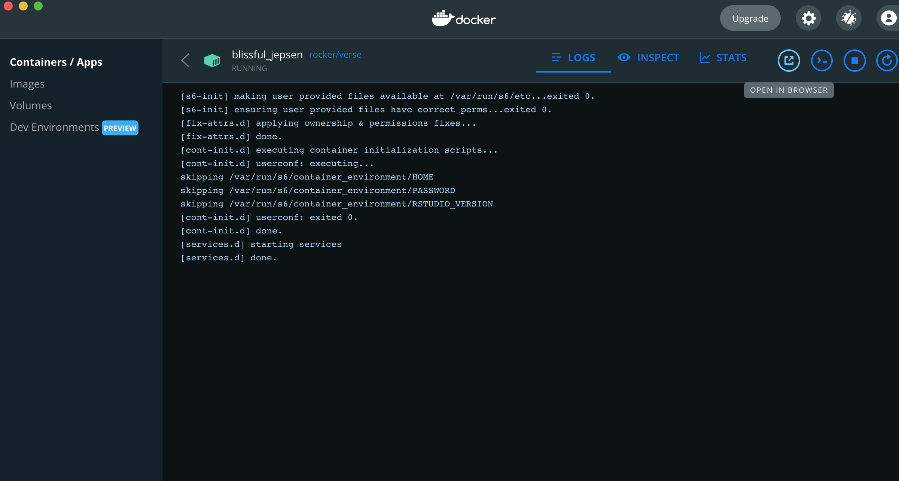
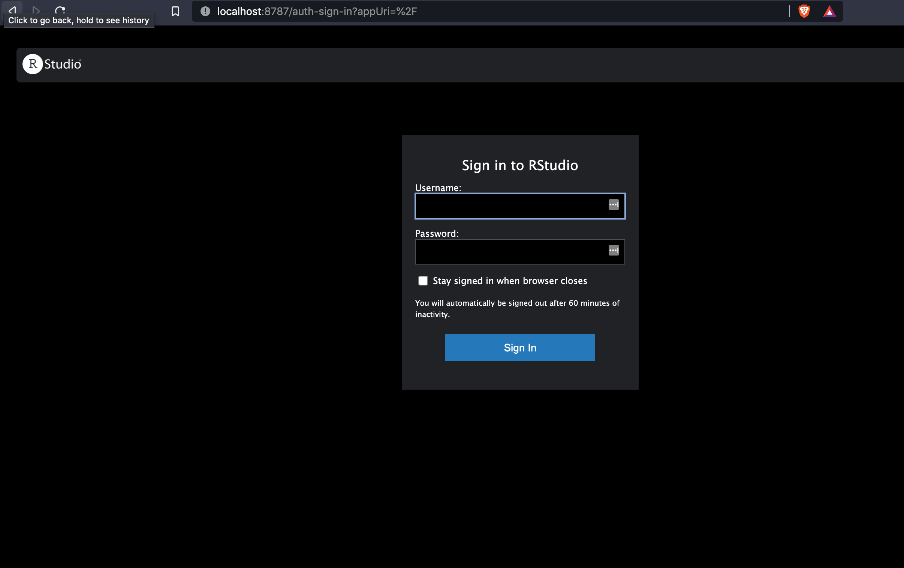
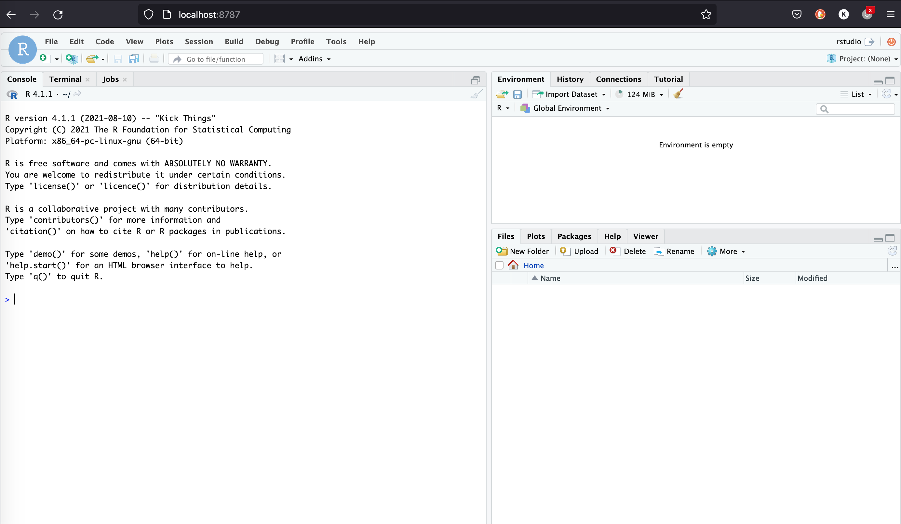
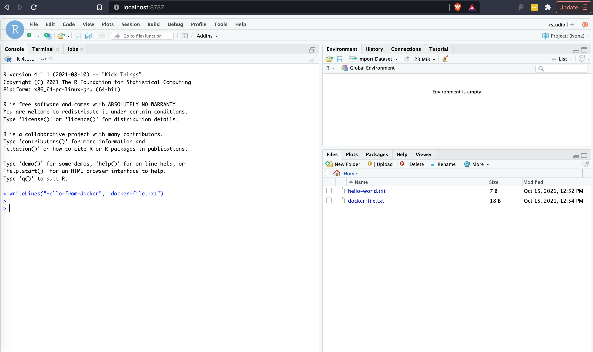
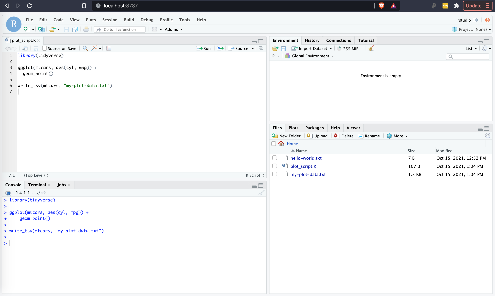

```{r setup, include=FALSE}
knitr::opts_chunk$set(echo = FALSE)
```

  We’ve built a [docker image](https://hub.docker.com/r/kenter/rstudio-scrnaseq) that contains the R packages used in the workshop and made it available on dockerhub. This image can be used if you have issues installing the recommended R packages. 
  
# What is docker? 

Docker is an application that allows identical software environments (called `images`) to be run in different operating systems (`MacOS`, `Linux` or `Windows`). The standardized  software environment (`programs`, `data`, and `configuration`) takes away the headache of trying to install and maintain software. Practically using docker also enforces a reproducible analysis environment. 

In this post we will discuss the basics of how to:  

  1) install docker  
  2) run docker on the command-line/terminal  
  3) run a docker container containing R, Rstudio
  4) run a docker container for this workshop that contains a variety of single cell packages 
  
# Install docker

MacOS:
Install Docker desktop here: https://docs.docker.com/desktop/mac/install/ 

Windows:
If you do not have the WSL enabled or installed, following the instructions here:
https://docs.microsoft.com/en-us/windows/wsl/install   

Then download and install Docker desktop for windows:
https://docs.docker.com/desktop/windows/install/  

Open the docker application to confirm installation.

# How to run a docker container

A docker `image` refers to the standarized software environment. A docker `container` is the copy of the image that is downloaded and run on a specific computer. 

If the docker application is running, then you should be able to run a docker container in the command line. Open up `Terminal` in `macOS` or  `PowerShell` in windows. 

If you run the following command, an image with R and Rstudio installed (`rocker/tidyverse`) will be downloaded from [`dockerhub`](https://hub.docker.com/u/rocker/#!) and activated. 

```bash
docker run --rm -e PASSWORD=rna -p 8787:8787 rocker/tidyverse
```

We'll explain the other command arguments in a moment.

You'll see some messages that will look something like this:

```bash
Unable to find image 'rocker/tidyverse:latest' locally
latest: Pulling from rocker/tidyverse
...
...
Status: Downloaded newer image for rocker/verse:latest
[s6-init] making user provided files available at /var/run/s6/etc...exited 0.
[s6-init] ensuring user provided files have correct perms...exited 0.
[fix-attrs.d] applying ownership & permissions fixes...
[fix-attrs.d] done.
[cont-init.d] executing container initialization scripts...
[cont-init.d] userconf: executing...
skipping /var/run/s6/container_environment/HOME
skipping /var/run/s6/container_environment/PASSWORD
skipping /var/run/s6/container_environment/RSTUDIO_VERSION
[cont-init.d] userconf: exited 0.
[cont-init.d] done.
[services.d] starting services
[services.d] done.
```

After running this command an rstudio instance will be running on your computer that you can access through your web browser. Open a browser and enter `http://`, followed by your ip address, followed by `:8787`. In you are on a linux or MacOS machine you can navigate to `http//:localhost:8787`. If you do not know the IP address you can find it in a few ways.

1) If you select the container in the docker desktop app, you can directly open the container in a browser by clicking the `open in browser` button. 

```{r}

```

2) You can obtain the IP address from the command line.  

Get list of all of your containers using docker ps
```bash
docker ps
CONTAINER ID   IMAGE          COMMAND   CREATED          STATUS          PORTS                                       NAMES
d2629b78er4f   rocker/verse   "/init"   14 minutes ago   Up 14 minutes   0.0.0.0:8787->8787/tcp, :::8787->8787/tcp   blissful_jepsen
```

Then use docker inspect get ip address using the value found under "CONTAINER ID"

```bash
docker inspect d2629b78er4f
```  

Just get the ip-address

```bash
docker inspect --format='{{range .NetworkSettings.Networks}}{{.IPAddress}}{{end}}' d2629b78er4f
```

Navigate to `http://Your.I.p.Address:8787`


You should see a Rstudio login page

```{r}

```

Login to rstudio with username `rstudio` and password `rna`. You should see Rstudio running in your browser. 

```{r}

```

 
Once you are done playing around in rstudio you can stop the container by terminating the process in your terminal:

Go back to your terminal and run CTRL + C in macOS or linux, or Ctrl+Break in Windows

You'll see a few more messages, then the command will exit back to your prompt

```bash
s6-finish] waiting for services.
[s6-finish] sending all processes the TERM signal.
[s6-finish] sending all processes the KILL signal and exiting.
$
```

When you initiated the docker container we used the following command:
```bash
docker run --rm -e PASSWORD=rna -p 8787:8787 rocker/tidyverse
```

The `--rm` is a special flag that tells docker to delete the container after exiting. You can verify this occurred by looking at your containers in Docker Desktop or by runnning `docker ps` on the command line. 

The `--rm` option is a good way to start working with docker. If you don't include this a new container will be made each time you execute `docker run` unless you provide different flags. This can quickly take up disk space if you are not careful so we recommend that you use `--rm` for now. The other advantage is this approach ensures that your R environment is restored to a clean environment each time you start the container. 

The `-e PASSWORD=rna` parameter specified that the password for logging into rstudio should be `rna`.  

The `-p 8787:8787` parameter specified that Rstudio should be served on the `8787` port. 


# How to use and create files on your local computer

You may have noticed that you do not have access to local files in the rstudio instance by default. This is expected behavior as the docker container exists in an isolated environment for your local computer. 

If you want to provide rstudio access to a local directory to allow reading and writing local files do the following:
 
1) Find the path to a directory on your computer
e.g. for the desktop on macOs use `~/Desktop` or for documents in windows `C:\Documents`

2) add the `-v` parameter which has the syntax `-v /path/to/local/directory:/path/in/container`. Because we are using `rstudio`, if we put files into the container at `/home/rstudio`, they will be visible to rstudio. 

Try it out: Here I am making my a class directory on my desktop (on a macOS) visible to rstudio. The class directory has 1 file called `hello-world.txt`. 

```bash
docker run --rm -v ~/Desktop/class:/home/rstudio -e PASSWORD=rna -p 8787:8787 rocker/tidyverse
``` 

In Rstudio I can now see the `hello-world.txt` file, and if I make a new file in R called `docker-file.txt`, it will now be visible on my local computer, and persist after I exit docker. 

```{r}

```

 Similarly you could write a R script or Rmarkdown document, run it in rstudio, then save the script into your local files for future reuse. 
 
```{r}

```
 
# Using docker for workshop

We have a docker image available on dockerhub that includes the packages that will be used in the class. 

[`rstudio-scrnaseq`](https://hub.docker.com/r/kenter/rstudio-scrnaseq)

You can use this image in the same manner as above, instead using `kenter/rstudio-scrnaseq:v0.2`.

Try it out:
```bash
docker run --rm -e PASSWORD=rna -p 8787:8787 kenter/rstudio-scrnaseq:v0.2
```

When you open rstudio you should be able to load `Seurat` and other single cell packages. We've also included a `test-install.Rmd` document that lists and loads all of the relevant installed packages, and tests basic Seurat commands. 
 
 
# Additional resources

 If you’ve never used docker here are some useful tutorials on using docker:
 
 https://bioconductor.org/help/docker/#quickstart  
 https://jsta.github.io/r-docker-tutorial/  
 https://replikation.github.io/bioinformatics_side/docker/docker/#important-commands  
 