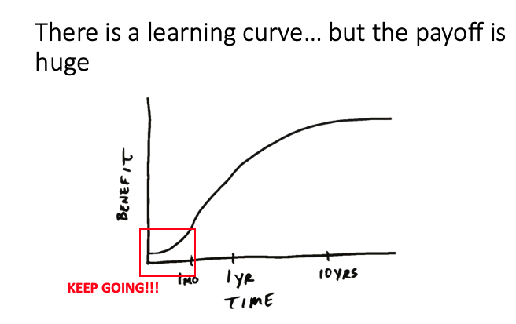
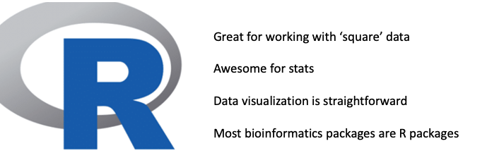
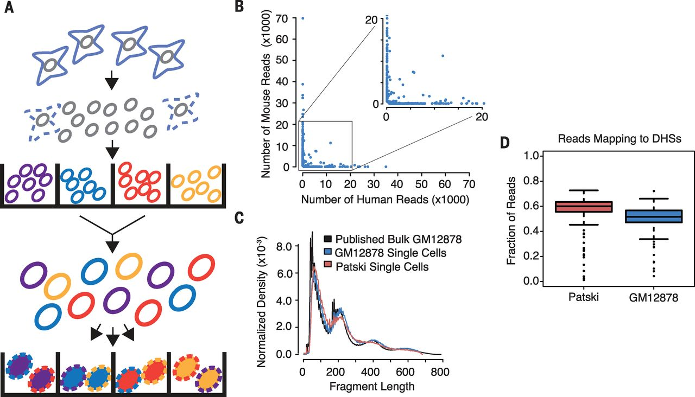

```{r "knitr options", echo = FALSE, message = FALSE, warning = FALSE}
knitr::opts_chunk$set(
  message = FALSE,
  warning = FALSE,
  collapse = TRUE,
  echo = FALSE,
  cache = FALSE,
  comment = "#>",
  fig.align = "center"
)
```

## intro to RBI
__rbi.fellows@ucdenver.edu__, 

RC1 South room9101

[office hours on Thursday afternoons](https://rnabioco.github.io/rbi-project-summary/office-hours.html)

## Welcome
{width=600px}


{width=800px}

## A couple notes on programming

For some, or many of you, this might be your first time programming. Since you are taking this course, I probably don't have to spend a ton of time convincing you of the benefits of learning how to code.  But I want to briefly touch on just a few of the benefits before proceeding with the lecture material.

{width=600px}

{width=600px}

## Languages of Bioinformatics
When it comes to bioinformatics, there are really 3 main languages/frameworks you will consistantly work with. These are: bash, R, and python. 

{width=600px}


## Why R?
In this course, we will almost exclusively be working with R.  R is a great first language to learn, because it is primarily used for data cleaning, analysis, visualization, and statistics.  It is also a great place to start, because many bioinformatics packages are written in R.  Finally, if you have done a lot of work in Excel (as most scientists have), the fundamental concepts and functions in R, should be fairly*** straightforward to pick up.

***with some practice

{width=600px}

## Where to go when you get stuck

One misconception I had when I started programming was that programmers have the knowledge to carry out most analyses prior to writing code.  Hollywood has created this archetype of the 'whiz-kid' or 'misunderstood genius hacker' who write code at lightning speed and who just know what code needs to be written and exactly how to write it. This is not how it works in the real world.  Most programmers I know spend far more time googling and thinking than writing code.  

You are going to get stuck a lot.

You are going to get a lot of error messages.

You are going to make mistakes.

### The key is to stick with it and to know where to go when you have problems

1. Stack overflow

2. RBI

3. Online tutorials

4. Biostars and SeqAnswers

5. Papers


... Now that we've covered an overview of programming tips, let's switch gears and switch gears to the reason you are all here 

# Single-cell Sequencing

RNA seq is similar to a fruit smoothie.  The individual fruits (strawberries, bananas, apples, oranges) that would make up the smoothie would be analogous to the different cell types in a population.  You blend up the fruits into the smoothie (lyse cells, extract RNA, and make libraries), and then you drink it (run it on a sequencer).

But when you drink a smoothie, its harder to tell which flavors came from which fruits than if you were to eat each fruit individually.  Especially if you had something unexpected, like kale***, in the smoothie.  This is analogous to bulk RNA-sequencing.  In bulk RNA seq, you lose all information about the cell of origin for each read.  If you wanted to know the RNA expression in a certain cell type, you had to try to purify that cell type from the smoothie and sequence it. Thereby losing all information about other cell types in your samples.

***yuck

Enter single cell seq.  Single cell sequencing technologies allow a researcher to tag individual cells with a unique sequence, called a barcode, that allows you to know which cell a read originates from. Therefore, you can computationally parse which reads came.

## Commonly used paradigms for single cell preps.  

### Droplet based

Through microfluics wizardy, cell gets loaded into a droplet with a bead with all the DNA bits needed to do the transcript barcoding

{width=600px}

## What's in the drop?

In theory, each drop will have (1) a cell and (2) a DNA bit that will do the barcoding.  This DNA bit contains a unique barcode, a UMI (for correcting PCR amplification), and an oligodT stretch (because mRNA).

{width=600px}


### Combinatorial Indexing
Through some clever (simple) math: (1) a small number of cells are loaded into each well a multi-well plate and barcoded.  Each well has a different barcode   (2) Then they are pooled back together (3) The process is repeated with a plate containing another set of barcodes.  The probability that 2 cells pick up the exact same combintation of barcodes becomes vanishingly small.

{width=600px}

### sci-fi seq

Combines the two methods and overloads the droplets

{width=600px}


## Tradeoffs between bulk RNA seq vs. single-cell seq

"There are no solutions, only trade-offs". And in the case of bulk RNA seq vs single-cell RNA seq, this is certainly true... for now. The information you gain about the cellular origin read from comes at a price:


1. only a small portion of the mRNAs from each cell are captured 

2. low number of detectable genes, might not detect low expressing genes at all

3. little info outside of gene counts 

### Think about the question you are trying to answer before running your experiment

1. Almost all sequencing experiments fail or succeed at the design step.

2. Programming cannot fix bad data.  Crap in crap out.


### alignment pipelines
[cellranger](https://support.10xgenomics.com/single-cell-gene-expression/software/pipelines/latest/installation) performs alignment, filtering, UMI counting, clustering, and gene expression analysis. 

Alternatives such as [Alevin](https://salmon.readthedocs.io/en/latest/alevin.html), [STARsolo](https://github.com/alexdobin/STAR/releases), [Kallisto](https://www.kallistobus.tools/)

```{r, engine = 'bash', eval = FALSE, echo = T}
# in terminal
cellranger count --id=123 \ 
                 --transcriptome=/refdata-cellranger-GRCh38-3.0.0 \ 
                 # build new transcriptome if you have GFP/RFP/transgene
                 --fastqs=/home/runs/HAT7ADXX/outs/fastq_path \ 
                 # a list of fastqs, a folder, or pass table via csv file
                 --sample=mysample 
                 # will need additional arguments for feature barcoding
```

output folder structure

```{r, echo=T, eval = F}
KO_1_CDNA
|-- KO_1_CDNA.mri.tgz
|-- SC_RNA_COUNTER_CS
|   |-- CLOUPE_PREPROCESS
|   |-- EXPAND_SAMPLE_DEF
|   |-- SC_RNA_COUNTER
|   `-- fork0
|-- _cmdline
|-- _filelist
|-- _finalstate
|-- _invocation
|-- _jobmode
|-- _log
|-- _mrosource
|-- _perf
|-- _sitecheck
|-- _tags
|-- _timestamp
|-- _uuid
|-- _vdrkill
|-- _versions
`-- outs
    |-- analysis
    |-- cloupe.cloupe # cloupe file for browser view
    |-- filtered_feature_bc_matrix # use this fold for seurat
    |-- filtered_feature_bc_matrix.h5
    |-- metrics_summary.csv
    |-- molecule_info.h5
    |-- possorted_genome_bam.bam
    |-- possorted_genome_bam.bam.bai
    |-- raw_feature_bc_matrix # or this for seurat
    |-- raw_feature_bc_matrix.h5
    `-- web_summary.html # qc summary
```
~ 5-8 hours per sample on biochem department cluster "Bodhi"

theoretically can be ran locally on linux, but will require at least 32GB of RAM

other campus options include Rosalind, AWS
https://github.com/rnabioco/cellrangerAWS

cellranger output [html](http://cf.10xgenomics.com/samples/cell-exp/3.1.0/5k_pbmc_protein_v3/5k_pbmc_protein_v3_web_summary.html) and [loupe](http://cf.10xgenomics.com/samples/cell-exp/3.1.0/5k_pbmc_protein_v3/5k_pbmc_protein_v3_cloupe.cloupe) files


## reading and making UMI-barcode elbow plots
{width=600px}

The total UMI (unique molecular identifier - represent each transcript) of a cell barcode is used to rank the barcodes determine the UMI threshold for signal vs noise. A plot is generated for cellranger html output, but will also be useful in other situations like hashing and CITE-seq.

{width=400px}

for a standard 10x scRNAseq run:

&nbsp;&nbsp;&nbsp;&nbsp;&nbsp;&nbsp;&nbsp;&nbsp;expected range of x axis (barcode) : ~ 10^5 (if using ggplot to visualize, filter) 
  
&nbsp;&nbsp;&nbsp;&nbsp;&nbsp;&nbsp;&nbsp;&nbsp;expected inflection point of x axis (cell number): ~ # of loaded cells / 2
  
&nbsp;&nbsp;&nbsp;&nbsp;&nbsp;&nbsp;&nbsp;&nbsp;expected range of y axis (UMI_counts) : ~ 10^4
  
&nbsp;&nbsp;&nbsp;&nbsp;&nbsp;&nbsp;&nbsp;&nbsp;expected inflection point of y axis (cutoff UMI count): ~ 1000


  
```{r, fig.width=3, fig.height=3, echo = T}
library(tidyverse)
# use "raw" instead of "filtered" cellranger output folder
data_url = "https://scrnaseq-workshop.s3-us-west-2.amazonaws.com"
m1 <- readRDS(url(file.path(data_url, "raw_matrix.rds")))
# all genes x all barcodes
counts <- Matrix::colSums(m1) # calculate total UMI read number for each cell barcode
countdf <- as.data.frame(counts) %>% 
  as_tibble(rownames = "barcode") %>% 
  filter(counts >= 2) %>% # throw out cell barcodes with 1 or less UMI, this is mainly for time purposes
  arrange(desc(counts)) %>% # arrange by descending order
  mutate(rank = 1:n()) # rank
head(countdf) # barcodes now ranked by UMI counts
ggplot(countdf, aes(x = rank, y = counts)) +
  geom_point() +
  labs(x = "barcodes", y = "UMI_counts") +
  theme_classic() +
  scale_x_log10() + 
  scale_y_log10()
```


## Creating a Seurat object

Single-cell RNA-seq counts are usually stored as a sparse matrix due to the high percentage of zeros. In a sparse matrix zeros are removed and only non-zero values are stored, which saves memory and speeds up operations.

The `Read10X` function can be used with the output directory generated by 10X Cell Ranger to load the counts data as a sparse matrix. 

```{r, echo = T}
# single cell analysis suite
library(Seurat)
# data frame manipulation and %>% functions
library(tidyverse)
```


```{r, echo = T}
# Import matrix of counts
pbmc.data <- Read10X(data.dir = "filtered_gene_bc_matrices/hg19/")

pbmc <- CreateSeuratObject(counts = pbmc.data, project = "pbmc3k", min.cells = 3, min.features = 200)
 
#min.cells- Include features detected in at least this many cells. Will subset the counts matrix as well. To reintroduce excluded features, create a new object with a lower cutoff.


#min.features- Include cells where at least this many features are detected.

head(pbmc@meta.data, 5)


```
```{r, echo = T}
# lets look at come of the count data.  It is called a sparse matrix because zeros are represented as '.' saves memory
pbmc.data[c("CD3D", "TCL1A", "MS4A1"), 1:30]

```

## Digging into the seurat object.  
At the top level, the Seurat object serves as a collection of Assay and DimReduc objects, representing expression data and dimensionality reductions of the expression data, respectively. The Assay objects are designed to hold expression data of a single type, such as RNA-seq gene expression, CITE-seq ADTs, cell hashtags, or imputed gene values. DimReduc objects represent transformations of the data contained within the Assay object(s) via various dimensional reduction techniques such as PCA.

See : https://github.com/satijalab/seurat/wiki/Seurat#slots for a more detailed explanation of the Seurat object
```{r, echo = T}

pbmc
```


```{r, echo = T}
# dim provides both nrow and ncol at the same time
dim(x = pbmc)
```

```{r, echo = T}
# Import matrix of counts
head(x=rownames(x=pbmc))
```

```{r, echo = T}
# Import matrix of counts
head(x = colnames(x = pbmc))
```


Pulling specific Assay, DimReduc, or Graph objects can be done with the double [[ extract operator. Adding new objects to a Seurat object is also done with the double [[ extract operator; Seurat will figure out where in the Seurat object a new associated object belongs.
```{r, echo = T}
# A vector of names of associated objects can be had with the names function.

names(x = pbmc)
```

```{r, echo = T}
# IThese can be passed to the double [[ extract operator to pull them from the Seurat object
pbmc[['RNA']]
```


```{r, echo = T}
# Looking at the metadata.  We will add another column to this later when we look at the percentage of reads per cell mapping to mitochondrial transcripts
head(pbmc@meta.data)
```
## QC and selecting cells for further analysis

Seurat allows you to easily explore QC metrics and filter cells based on any user-defined criteria. A few QC metrics commonly used by the community include

The number of unique genes detected in each cell.

Low-quality cells or empty droplets will often have very few genes.

Cell doublets or multiplets may exhibit an aberrantly high gene count.

Similarly, the total number of molecules detected within a cell (correlates strongly with unique genes)


## Filtering Mito genes
The percentage of reads that map to the mitochondrial genome is indicative of dying cells.

Low-quality / dying cells often exhibit extensive mitochondrial contamination.

We calculate mitochondrial QC metrics with the PercentageFeatureSet() function, which calculates the percentage of counts originating from a set of features
We use the set of all genes starting with MT- as a set of mitochondrial genes

```{r, echo = T}
#We will add a column to the metadata calculating the percentage of genes mapping to mitochondrial transcripts
pbmc[["percent.mt"]] <- PercentageFeatureSet(pbmc, pattern = "^MT-")
#We can now see that the metadata now includes the percentage of mitochondrial genes
head(pbmc@meta.data, 5)
```


```{r, echo = T}
#We can also peak into the metadata by examining just a particular column.  Similar to dplyr functions.  Try erasing 'percent mito' and tab completing
head(x = pbmc$percent.mt)
```


```{r, echo = T}
# Visualize QC metrics as a violin plot
VlnPlot(pbmc, features = c("nFeature_RNA", "nCount_RNA", "percent.mt"), ncol = 3)
```
##  Subsetting 

We want to remove low quality cells for our downstream analyses.  Using the plot above, we can draw some cutoffs by eye.  Here we will filter out cells by getting rid of cells that have unique feature counts over 2,500 or less than 200.  We also filter cells that have >5% mitochondrial counts

```{r, echo = T}
pbmc <- subset(pbmc, subset = nFeature_RNA > 200 & nFeature_RNA < 2500 & percent.mt < 5)
```

```{r, echo = T}
#Note that some cells were filtered out- We started with 2700
dim(x = pbmc)

```
## Normaliztion

After removing unwanted cells from the dataset, the next step is to normalize the data. By default, we employ a global-scaling normalization method “LogNormalize” that normalizes the feature expression measurements for each cell by the total expression, multiplies this by a scale factor (10,000 by default), and log-transforms the result. Normalized values are stored in pbmc[["RNA"]]@data.

Think of this step as normalizing expression of each transcripts to the read depth for all genes in that cell.  The log transofrmation will compress lowly and highly expressed genes to a more similar scale

```{r, echo = T}
pbmc <- NormalizeData(pbmc, normalization.method = "LogNormalize", scale.factor = 10000)
head(pbmc[["RNA"]]@data,100)
```


## Identification of highly variable features (feature selection)

We next calculate a subset of features that exhibit high cell-to-cell variation in the dataset (i.e, they are highly expressed in some cells, and lowly expressed in others). This analysis helps to highlight biological signal in single-cell datasets.

We will use theFindVariableFeatures() function. By default, we return 2,000 features per dataset. These will be used in downstream analysis, like PCA.

Why do you think it is important to look only at the most variable genes?  Any ideas based off the pre class lecture?


```{r, echo = T}
pbmc <- FindVariableFeatures(pbmc, selection.method = "vst", nfeatures = 2000)

# Identify the 10 most highly variable genes
top10 <- head(VariableFeatures(pbmc), 10)

# plot variable features with and without labels
plot1 <- VariableFeaturePlot(pbmc)
plot2 <- LabelPoints(plot = plot1, points = top10, repel = TRUE)
plot2
```
## Scaling the data

Next, we apply a linear transformation (‘scaling’) that is a standard pre-processing step prior to dimensional reduction techniques like PCA. The ScaleData() function:

Shifts the expression of each gene, so that the mean expression across cells is 0
Scales the expression of each gene, so that the variance across cells is 1
This step gives equal weight in downstream analyses, so that highly-expressed genes do not dominate
The results of this are stored in pbmc[["RNA"]]@scale.data


```{r, echo = T}
all.genes <- rownames(pbmc)
pbmc <- ScaleData(pbmc, features = all.genes)
View(pbmc[["RNA"]]@scale.data)
```
## PCA
Finally, we are ready to run PCA.  This can be achieved using the RunPCA() command.  

After running PCA, we will want to determine how important each gene is in determining each PC. This might give us ideas about marker genes to use for downstream exploration.  To determine each genes contribution, we want to visualize their loading scores.  I touch on this in the PCA video here: https://www.youtube.com/watch?v=GtKBZGJbnAg.


```{r, echo = T}
pbmc <- RunPCA(pbmc, features = VariableFeatures(object = pbmc))
# Examine and visualize PCA results a few different ways
print(pbmc[["pca"]], dims = 1:5, nfeatures = 5)
```
```{r, echo = T}
#Let's take a look at the loadings
VizDimLoadings(pbmc, dims = 1:2, reduction = "pca")
```

In particular DimHeatmap() allows for easy exploration of the primary sources of heterogeneity in a dataset, and can be useful when trying to decide which PCs to include for further downstream analyses. Both cells and features are ordered according to their PCA scores. Setting cells to a number plots the ‘extreme’ cells on both ends of the spectrum, which dramatically speeds plotting for large datasets. Though clearly a supervised analysis, we find this to be a valuable tool for exploring correlated feature sets.


```{r, echo = T}
DimHeatmap(pbmc, dims = 1, cells = 500, balanced = TRUE)
```

```{r, echo = T}
DimHeatmap(pbmc, dims = 1:15, cells = 500, balanced = TRUE)
```
As can be seen above, by PC10, the heatmaps are staring to show less defined clustering.  This can be useful info when we decide how many PCs to carry over in future dimensionality reduction methods like UMAP and T-SNE

An Elbow plot can also be informative, and is very similar to the scree plot I showed in the video on PCA

```{r, echo = T}
ElbowPlot(pbmc)
```

Finally we can visualize how well our first two principle components segregate our data

```{r, echo = T}
DimPlot(pbmc, reduction = "pca")
```
We are starting to see some separation of data, but we can probably cluster these cells better.  Tomorrow we will review PCA and look into UMAP and T-SNE, which will do a better job at clustering our data.  


```{r, echo = T}
ElbowPlot(pbmc)
```


