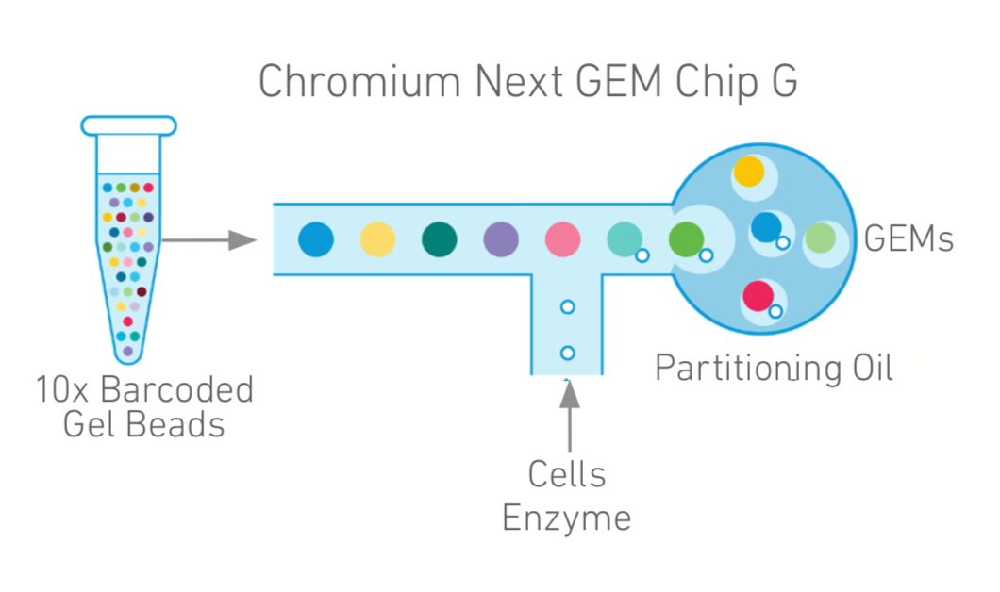

```{r "knitr options", echo = FALSE, message = FALSE, warning = FALSE}
knitr::opts_chunk$set(
  message = FALSE,
  warning = FALSE,
  collapse = TRUE,
  echo = FALSE,
  comment = "#>",
  fig.align = "center"
)
```
<style type="text/css">
.main-container {
  max-width: 2800px !important;
  width: 2800px !important;
  margin-left: 0px !important;
  margin-right: 0px !important;
}
body {
      max-width: 2800px !important;
    }
.table {
    width: 100%;
}
</style>

## intro to RBI
__rbi.fellows@ucdenver.edu__, 

RC1 South room 9101

[office hours on Thursdays](https://rnabioco.github.io/rbi-project-summary/office-hours.html)

## outline of the workshop
* Day 1 (pm):
  + Intro to scRNAseq
  + Data preprocessing
  + Import into R
  + Quality control

* Day 2 (am):
  + Projections
  + Clustering
  + Finding markers
  + Annotating cell types

* Day 2 (pm):
  + Pseudotime analysis
  + Dataset alignment

* Day 3 (am):
  + Multimodal data (CITE-seq, hashing)
  + Miscellaneous

* Day 3 (pm) : working through your own data

## single cell RNA sequencing overview
cells -> cDNA -> fastq -> gene expression matrix -> 

&nbsp;&nbsp;&nbsp;&nbsp;filtering -> preprocessing -> dimension reduction -> clustering -> identity and markers -> pseudotime

## limitations of scRNAseq
```{r, fig.width=9, fig.height=3}
# from seurat example
library(Seurat)
pbmc3k <- readRDS("/Users/rf/Downloads/pbmc3k_final.rds")
a <- DimPlot(pbmc3k, label = T) + NoLegend()
b <- FeaturePlot(pbmc3k, "CD4")
c <- FeaturePlot(pbmc3k, "CD8B")
cowplot::plot_grid(a,b,c, nrow = 1)
```

1. dropout effect (see: GFP and other supposed markers)

2. low number of detectable genes, might not detect low expressing genes at all (see: TFs)

3. little info outside of gene counts (see: tail-seq, isoform info)

4. discrepancies between RNA and protein (see: CD4+ vs CD8+)

5. constantly evolving chemistry and bioinformatics tools (see: 10x v2/v3/v3.1, [bad cell calling in cellrangerV2](https://support.10xgenomics.com/single-cell-gene-expression/software/pipelines/latest/algorithms/overview#cell_calling))

## experimental design >> informatics corrections
{width=400px}

1. too few or too many cells - 1000 cell lower limit for capture, and waste of money

2. doublets - 10000 cells ~ 10% doublet rate  
&nbsp;&nbsp;&nbsp;&nbsp;&nbsp;&nbsp;&nbsp;&nbsp;(try: [scrublet](https://github.com/AllonKleinLab/scrublet))

3. cell death - worse RNA capture, potentially different expression profile  
&nbsp;&nbsp;&nbsp;&nbsp;&nbsp;&nbsp;&nbsp;&nbsp;(try: MT-RNA cutoff, regress out MT-RNA score)

4. lysed/free RNA - background for all cells, interferes with clustering and markers  
&nbsp;&nbsp;&nbsp;&nbsp;&nbsp;&nbsp;&nbsp;&nbsp;(try: [SoupX](https://github.com/constantAmateur/SoupX))
```{r, fig.width=9, fig.height=3}
# from seurat example
library(Seurat)
pbmc_hem <- readRDS("/Users/rf/pbmcTSNE")
pbmc_hem <- UpdateSeuratObject(object = pbmc_hem)
a <- DimPlot(pbmc_hem, label = T) + NoLegend()
b <- FeaturePlot(pbmc_hem, "HBB")
c <- FeaturePlot(pbmc_hem, "JCHAIN")
cowplot::plot_grid(a,b,c, nrow = 1)
```

5. different sex of mice in samples - makes sample comparisons harder  
&nbsp;&nbsp;&nbsp;&nbsp;&nbsp;&nbsp;&nbsp;&nbsp;(try: ignore known sex-dependent genes)

6. batch effects - still preferrable to have all, or at least the direct comparison samples, captured at the same time  
&nbsp;&nbsp;&nbsp;&nbsp;&nbsp;&nbsp;&nbsp;&nbsp;(try: various alignment methods)

7. n = ? - no consensus in the field, but aggregating 2 or more biological repeats, or hash multiple samples at the same time, should be valid

## general pipeline and alternatives
### 1. sequencing methods
main platforms: 10x vs Smart-seq2 vs sci-RNA-seq3

```{r table1, echo=FALSE, message=FALSE, warnings=FALSE, results='asis'}
tab <- "
|method        |cell isolation      |coverage       |saturation read # |gene detection  |throughput and cost        |
|--------------|--------------------|---------------|------------------|----------------|---------------------------|
|10x Chromium  |droplet-based       |polyA+ 3' only |10^5 per cell     |~2000 per cell  |~5k cells, low cost        |
|Smart-seq2    |FACS-sorted         |full length    |10^6 per cell     |~4000 per cell  |manual pipetting, high cost|
|sci-RNA-seq3   |combinatorial index |polyA+ 3' only |10^5 per cell     |~1000 per cell  |~1m cells, lowest cost     |
"
cat(tab)
```

variations within 10x system: standard 3', 5' + V(D)J, hashing, CITE-seq, variant-calling (very different sample prep, may require up to 4 library preps per sample)

### 2. alignment pipelines
cellranger (alternatives such as Alevin, STARsolo, kallisto)
```{r, engine = 'bash', eval = FALSE, echo = T}
# in terminal
cellranger count --id=sample345 \
                 --transcriptome=/refdata-cellranger-GRCh38-3.0.0 \
                 --fastqs=/home/runs/HAWT7ADXX/outs/fastq_path \
                 --sample=mysample
```
~ 5-8 hours per sample on biochem department cluster Bodhi

theoretically can be ran locally on linux, but will require at least 32GB of RAM

other campus options include Rosalind, AWS

cellranger output [html](http://cf.10xgenomics.com/samples/cell-exp/3.1.0/5k_pbmc_protein_v3/5k_pbmc_protein_v3_web_summary.html) and [loupe](http://cf.10xgenomics.com/samples/cell-exp/3.1.0/5k_pbmc_protein_v3/5k_pbmc_protein_v3_cloupe.cloupe) files

### 3. key things to check for in the initial output
1. number of cells close to expectations? Is the elbow plot reasonable?
2. reads per cell (this is merely calculated as reads/cells, so somewhat inaccurate) - ideally ~50-100k, 
3. genes per cell, ideally ~2000
4. sequencing saturation?
5. any structure in the dimension reduction tSNE?

### 4. downstream processing in R or python
1. more accurate cell calling
2. more stringent filtering
3. regress out unwanted sources of variance
4. appropriate choice of normalization method
5. UMAP instead of tSNE projections, and fine-tuning
6. fine-tuning of dataset alignment methods and parameters (by default cellranger does align during aggregation)
7. find marker genes and assign cluster identities (may merge some)
8. more flexible visualizations
9. GO term analysis and other things
10. export to a hosted browser, similar to cloupe

## reading UMI-barcode elbow plots
{width=400px}

The total UMI (unique molecular identifier - present each transcript) of a cell barcode is used to rank the barcodes determine the UMI threshold for signal vs noise. A plot is generated for cellranger html output, but can be useful in other situations like hashing and CITE-seq.

for a standard scRNAseq run:

&nbsp;&nbsp;&nbsp;&nbsp;&nbsp;&nbsp;&nbsp;&nbsp;expected range of x axis (barcode) : > 10^5 (if using ggplot to visuualize, might want to filter) 
  
&nbsp;&nbsp;&nbsp;&nbsp;&nbsp;&nbsp;&nbsp;&nbsp;expected inflection point of x axis (cell number): ~ # of loaded cells / 2
  
&nbsp;&nbsp;&nbsp;&nbsp;&nbsp;&nbsp;&nbsp;&nbsp;expected range of y axis (UMI_counts) : > 10^4
  
&nbsp;&nbsp;&nbsp;&nbsp;&nbsp;&nbsp;&nbsp;&nbsp;expected inflection point of y axis (cutoff UMI count): >= 1000
  
```{r, fig.width=6, fig.height=3, echo = T}
library(tidyverse)
m1 <- readRDS("raw_matrix1.rds")
m2 <- readRDS("raw_matrix2.rds")

counts <- Matrix::colSums(m1)
countdf <- as.data.frame(counts) %>% as_tibble(rownames = "barcode") %>% filter(counts >= 1) %>% arrange(desc(counts)) %>% mutate(n = 1:n())
g1 <- ggplot(countdf, aes(x = n, y = counts)) +
  geom_point() +
  labs(x = "barcodes", y = "UMI_counts") +
  theme_classic() +
  scale_x_log10() + 
  scale_y_log10()

counts <- Matrix::colSums(m2)
countdf <- as.data.frame(counts) %>% as_tibble(rownames = "barcode") %>% filter(counts >= 1) %>% arrange(desc(counts)) %>% mutate(n = 1:n())
g2 <- ggplot(countdf, aes(x = n, y = counts)) +
  geom_point() +
  labs(x = "barcodes", y = "UMI_counts") +
  theme_classic() +
  scale_x_log10() + 
  scale_y_log10()

cowplot::plot_grid(g2, g1, nrow = 1, labels = c("good", "bad"))
```

## briefly, tidyverse/dplyr verbs
The tidyverse is a collection of R packages designed for data science. All packages share design philosophy, grammar, and data structures. 

Seurat also uses some of the grammar, such as `group.by`.

A large amount of code introduced in this workshop in based on matrix and dataframe manipulation. Therefore some basic understanding of tidyverse/dplyr will be helpful.

Also, "%>%" is used as "pipe", similar to unix `|`.
```{r}
library(tidyverse)
#note that tidyverse is philosophically against rownames
meta <- pbmc3k@meta.data %>% as_tibble(rownames = "cell_id")
meta %>% head() %>% print() # <- same as print(head(meta))
```

```{r, echo = T}
#"select" certain columns of data.
meta2 <- meta %>% select(cell_id, nCount_RNA, percent.mt, seurat_clusters)
meta2 %>% head() %>% print()
```

```{r, echo = T}
#"filter" data to select specific rows.
meta2 %>% filter(percent.mt <= 2) %>% head() %>% print()
```

```{r, echo = T}
#"arrange" the rows of your data into an order.
meta2 %>% filter(percent.mt <= 2) %>% arrange(percent.mt) %>% head() %>% print()
```

```{r, echo = T}
#"mutate" your data frame to contain new columns.
meta3 <- meta2 %>% mutate(serurat_clusters = str_c("cluster_", seurat_clusters), mt = percent.mt/100)
meta3 %>% head() %>% print()
```

```{r, echo = T}
#"summarise" chunks of you data in some way.
meta3 %>% group_by(seurat_clusters) %>% summarize(n = n()) %>% head() %>% print()
```

links
reading material