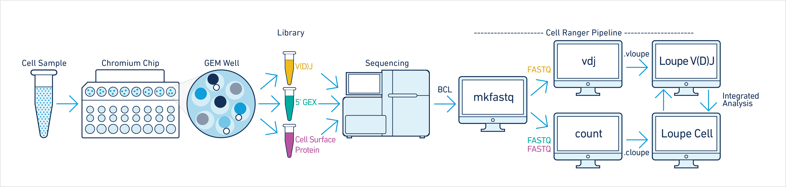

```{r "setup", include = FALSE}
# Chunk opts
knitr::opts_chunk$set(
  echo    = TRUE,
  warning = FALSE,
  message = FALSE,
  comment = "#>"
)

# Packages
library(tidyverse)
library(cowplot)
library(colorblindr)
library(here)
library(Seurat)
library(djvdj)

# Okabe Ito color palettes
vdj_colors <- c(
  palette_OkabeIto[1:4], "#d7301f", 
  palette_OkabeIto[5:6], "#6A51A3", 
  palette_OkabeIto[7:8], "#875C04"
)
```

<br>

### V(D)J Sequencing

For 10x single-cell immune profiling, the initial steps of GEM formation and reverse transcription are the same. After reverse transcription within each GEM, a portion of the pooled cDNA is further amplified using a primer specific for the V(D)J constant region. The amplified cDNA is then fragmented which results in fragments of various length that span the entire gene. The remaining cDNA that was not amplified using V(D)J specific primers is used to generate the gene expression library. This ultimately results in separate gene expression and V(D)J libraries that include the same cell barcodes.

Single-cell V(D)J libraries are typically sequenced at a depth of ~10k reads per cell. After sequencing, the raw fastq files are processed separately from the gene expression libraries using the [Cell Ranger](https://support.10xgenomics.com/single-cell-vdj/software/pipelines/latest/using/vdj) software available through 10x Genomics.



When analyzing the V(D)J results alongside single-cell gene expression data, there are several key differences to keep in mind. The main goal of V(D)J sequencing is to accurately assemble each chain expressed in the cell, not to quantify changes in expression. Due to this difference, the total number of UMIs obtained for each cell can be much lower than the gene expression libraries. In addition, when processing gene expression data, reads with the same UMI are normally discarded. However, for V(D)J sequencing these reads are kept and are important for obtaining sufficient coverage to accurately assemble each chain.


For this vignette we are using single-cell TCR data provided by the Rincon lab. Thymocytes were collected for wild type mice and mice expressing mutant Gsk3b that is predicted to cause cell death and impair repertoire development. Cells were sorted for two different developmental timepoints, DN3 and DN4.

We are starting with a Seurat object containing gene expression data that has already been processed using the basic Seurat workflow. This includes the following key commands: CreateSeuratObject, NormalizeData, FindVariableFeatures, ScaleData, RunPCA, RunUMAP, FindNeighbors, and FindClusters.

```{r "rna_umap", fig.width = 12.5, fig.height = 5, echo = FALSE}
load("data/so_tcr.rda")

# Sample UMAP
key_umap <- so_tcr %>%
  DimPlot(
    group.by = "orig.ident",
    cols     = vdj_colors
  ) +
  ggtitle("Sample") +
  theme_nothing() +
  theme(
    plot.title = element_text(),
    legend.position = "right"
  )

# Cluster UMAP
clust_umap <- so_tcr %>%
  DimPlot(group.by = "seurat_clusters") +
  ggtitle("Cluster") +
  theme_nothing() +
  theme(
    plot.title = element_text(),
    legend.position = "right"
  )

# Final figure
plot_grid(
  key_umap, clust_umap,
  rel_widths = c(1, 0.9)
)
```

<br>

### Import VDJ data

All the tools that we will be using are available from the [djvdj](https://github.com/rnabioco/djvdj) package that we are developing here at the RBI.

The function import_vdj takes the output files from [Cell Ranger](https://support.10xgenomics.com/single-cell-vdj/software/pipelines/latest/using/vdj#header) and adds clonotype information to the meta.data for an existing [Seurat](https://satijalab.org/seurat/) object. For cells with multiple chains, the information for each chain is stored as a single row, separated by a semicolon. For cells that do not have any VDJ sequencing data, NAs will be added to the meta.data.

If the Seurat object contains data for multiple runs, a vector containing paths to the VDJ data for each sample can be given. If multiple paths are provided, cell prefixes should be included as names for the vector. 

```{r "import_vdj"}
# Create vector of paths pointing to cellranger output
paths <- c(
  KI_DN3_GE = "data/KI_DN3_TCR",
  KI_DN4_GE = "data/KI_DN4_TCR",
  WT_DN3_GE = "data/WT_DN3_TCR",
  WT_DN4_GE = "data/WT_DN4_TCR"
)

so_tcr <- import_vdj(
  sobj_in = so_tcr,                  # Seurat object
  vdj_dir = paths                    # cellranger directories
)
```

Take a look at the meta.data to see the V(D)J data added to the object.

```{r}
vdj_cols <- c(
  "chains", "cdr3",   "cdr3_nt",
  "v_gene", "j_gene", "c_gene",
  "reads",  "umis"
)

so_tcr@meta.data %>%
  as_tibble() %>%
  filter(!is.na(clonotype_id), n_chains > 1) %>%
  select(all_of(vdj_cols))
```

<br>

### Quality Control

#### Read Support

The read support for each chain can be visualized with the plot_reads() function. This will create plots summarizing the number of UMIs and total reads that were obtained for each chain.

```{r "read_support", fig.width = 6.5, fig.height = 3}
plot_reads(
  sobj_in     = so_tcr,                     # Seurat object
  cluster_col = "orig.ident",               # Column containing labels to group by
  plot_colors = vdj_colors
)
```

<br>

#### Paired Chains

The V(D)J data imported from Cell Ranger will include clonotypes that do not have paired alpha and beta chains. To assess which cells have paired alpha and beta chains, we can overlay the labels present in the chains column on a UMAP projection.

```{r "chains_umap", fig.width = 5.5, fig.height = 3.7}
so_tcr %>%
  DimPlot(group.by = "chains") +
  vdj_theme()
```

We can also summarize the fraction of cells that belong to each group.

```{r "chains_bars", fig.width = 5, fig.height = 3}
so_tcr@meta.data %>%
  ggplot(aes(seurat_clusters, fill = chains)) +
  geom_bar(position = "fill") +
  labs(y = "fraction") +
  vdj_theme() +
  theme(legend.title = element_blank())
```

The djvdj package provides several functions that can be used to manipulate the object meta.data. This includes a function to modify meta.data columns (mutate_vdj) and a function to filter cells from the object (filter_vdj). Since cells can have multiple values present in each V(D)J column, when using these functions each string of values for a cell should be thought of as a vector.

Since we are using DN3 and DN4 thymocytes for this dataset, we expect a large fraction of cells to have unpaired alpha and beta chains. However, for other TCR datasets filter_vdj can be used to remove V(D)J data for cells that lack paired chains. Setting filter_cells to FALSE will keep all cells in the object, but the V(D)J data will be removed.

```{r}
# Example showing how paired chains can be filtered
x <- filter_vdj(
  sobj_in      = so_tcr,                            # Seurat object
  filt         = all(c("TRA", "TRB") %in% chains),  # Condition for filtering
  filter_cells = FALSE                              # Should cells be removed
)

# Take a look at the meta.data
x@meta.data %>%
  as_tibble() %>%
  filter(!is.na(clonotype_id)) %>%
  select(all_of(vdj_cols))
```

To further illustrate how filter_vdj works we can look at row 3 shown above, which has one alpha and two beta chains. When filtering this row we are evaluating whether the following condition is TRUE:

```{r}
vec <- c("TRA", "TRB", "TRB")

all(c("TRA", "TRB") %in% vec)
```

<br>

### Clonotype Abundance

To identify the top clonotypes in each sample or cluster, clonotype abundance can be calculated using the calc_abundance function. These calculations can be performed on a per-cluster or per-sample basis by also providing a meta.data column containing cell labels.

```{r}
so_tcr <- calc_abundance(
  sobj_in       = so_tcr,                   # Seurat object
  clonotype_col = "cdr3_nt",                # meta.data column containing clonotype IDs
  cluster_col   = "orig.ident"              # meta.data column containing cell labels
)
```

For each 'calc' function provided by djvdj, there is a matching 'plot' function that will generate a summary plot. The plot_abundance function will plot clonotypes ranked by abundance. The yaxis argument can be used to change the units between percent and frequency.

```{r "abund_plots", fig.width = 10, fig.height = 5}
plot_abundance(
  sobj_in       = so_tcr,                   # Seurat object
  clonotype_col = "cdr3_nt",                # meta.data column containing clonotype IDs
  cluster_col   = "orig.ident",             # meta.data column containing cell labels
  label_col     = "cdr3",                   # meta.data column containing labels
  plot_colors   = vdj_colors
)
```

<br>

### Repertoire Diversity

The function calc_diversity will calculate repertoire diversity on number of cells that share each clonotype. Using the cluster_col argument, any meta.data column containing cell labels can be used for calculations. calc_diversity uses the R package [abdiv](https://github.com/kylebittinger/abdiv) for performing diversity calculations and any abdiv diversity function that accepts count data can be specified using the method argument. Before using any of these methods, it is important to read the documentation.

Possible methods for calculating diversity include:

```{r, comment = "", echo = F}
abdiv::alpha_diversities
```

In this example we are calculating the Simpson diversity index for each sample in the orig.ident meta.data column. A value close to 1 indicates maximum diversity.

```{r}
so_tcr <- calc_diversity(
  sobj_in       = so_tcr,                   # Seurat object
  clonotype_col = "cdr3_nt",                # meta.data column containing clonotype ids
  cluster_col   = "orig.ident",             # meta.data column containing cell labels
  method        = abdiv::simpson            # Method to use
)
```

The plot_diversity function will create plots summarizing repertoire diversity for each sample. All four samples are very diverse.

```{r "div_plots", fig.width = 4, fig.height = 3}
plot_diversity(
  sobj_in       = so_tcr,                   # Seurat object
  clonotype_col = "cdr3_nt",                # meta.data column containing clonotype ids
  cluster_col   = "orig.ident",             # meta.data column containing cell labels
  method        = abdiv::simpson,           # Method to use
  plot_colors   = vdj_colors
)
```

<br>

### Repertoire Overlap

To compare repertoires for different samples or clusters, calc_similarity can calculate a variety of different similarity metrics. The cluster_col should be used to specify the meta.data column containing cell labels for comparison. Like calc_diversity, any [abdiv](https://github.com/kylebittinger/abdiv) function that accepts count data can be specified with the method argument. Before using any of these methods, it is important to read the documentation for the method to make sure it is appropriate.

By default calc_similarity will add a new meta.data column for each comparison. In this example we are calculating the Jaccard dissimilarity index for all combinations of cell labels present in the orig.ident column. The Jaccard index is calculated by dividing the number of overlapping clonotypes by the total number of unique clonotypes. In the abdiv package this value is then subtracted from 1, so a number close to 0 indicates strong overlap. 

```{r}
# abdiv::jaccard(
#   x = c(0, 5, 10),
#   y = c(1, 7, 0)
# )
# 1 / 3 = 0.333 -> 1 - 0.33 = 0.667

so_tcr <- calc_similarity(
  sobj_in       = so_tcr,                   # Seurat object
  clonotype_col = "cdr3_nt",                # meta.data column containing clonotype ids
  cluster_col   = "orig.ident",             # meta.data column containing cell labels
  method        = abdiv::jaccard            # abdiv method to use
)
```

A heatmap summarizing the results can be generated using the plot_similarity function. Here we are creating two heatmaps, one to compare the different samples and one to compare cell clusters. We do not see substantial overlap between any of the samples or cell clusters.

```{r "sim_plots", fig.width = 10, fig.height = 4}
# Sample heatmap
ident_heat <- plot_similarity(
  sobj_in       = so_tcr,                   # Seurat object
  clonotype_col = "cdr3_nt",                # meta.data column containing clonotype IDs
  cluster_col   = "orig.ident",             # meta.data column containing cell labels
  method        = abdiv::jaccard,           # Method to use
  plot_colors   = "#009E73"
)

# Cluster heatmap
clust_heat <- plot_similarity(
  sobj_in       = so_tcr,
  clonotype_col = "cdr3_nt",
  cluster_col   = "seurat_clusters",
  method        = abdiv::jaccard,
  plot_colors   = "#56B4E9",
  size          = 0.2,                      # Additional ggplot options
  color         = "white"                   # Additional ggplot options
) +
  theme(axis.text.x = element_text(angle = 0))

# Combine heatmaps
plot_grid(ident_heat, clust_heat, align = "h")
```

<br>

### Gene Usage

The V(D)J data imported from Cell Ranger also includes the specific genes detected for each cell. The function calc_usage can be used to calculate the fraction of cells that use each V(D)J gene. This function will produce a table summarizing the results. To only include results for a certain chain, the chain argument can be used to specify the chain of interest. By default the results for all chains will be included.The yaxis argument can be used to change the units between percent and frequency.

In this example we are summarizing the usage of different V genes for the TRB chain 

```{r, eval = F}
calc_usage(
  sobj_in     = so_tcr,                     # Seurat object
  gene_cols   = "v_gene",                   # meta.data column containing genes
  cluster_col = "orig.ident",               # meta.data column containing cell labels
  chain       = "TRB"                       # Chain to use for filtering genes
)
```

The function plot_usage can be used to summarize these results. Using the yaxis argument, the percent or absolute count (frequency) can be used for plotting. The genes plotted can also be selected using the plot_genes argument, or the number of top genes (most frequent) to plot can be specified with n_genes.

```{r "gene_usage_1", fig.width = 11, fig.height = 3.5}
plot_usage(
  sobj_in     = so_tcr,                     # Seurat object
  gene_cols   = "v_gene",                   # meta.data column(s) containing genes
  chain       = "TRB",                      # Chain to use for filtering genes
  cluster_col = "orig.ident",
  plot_colors = vdj_colors
)
```

By passing multiple columns to gene_cols, the frequency that different genes are used together can also be summarized.

```{r, eval = F}
calc_usage(
  sobj_in     = so_tcr,                     # Seurat object
  gene_cols   = c("v_gene", "j_gene"),      # meta.data column(s) containing genes
  cluster_col = "orig.ident",               # meta.data column containing cell labels
  chain       = "TRB"                       # Chain to use for filtering genes
)
```

When multiple gene columns are passed to plot_usage, a list of plots will be returned, one for each cell label in the cluster_col column.

```{r "gene_usage_2", fig.width = 12, fig.height = 8}
ggs <- plot_usage(
  sobj_in     = so_tcr,                     # Seurat object
  gene_cols   = c("v_gene", "j_gene"),      # meta.data column(s) containing genes
  cluster_col = "orig.ident",               # meta.data column containing cell labels
  chain       = "TRB"                       # Chain to use for filtering genes
) %>%
  imap(~ .x + ggtitle(.y))

plot_grid(plotlist = ggs)
```
