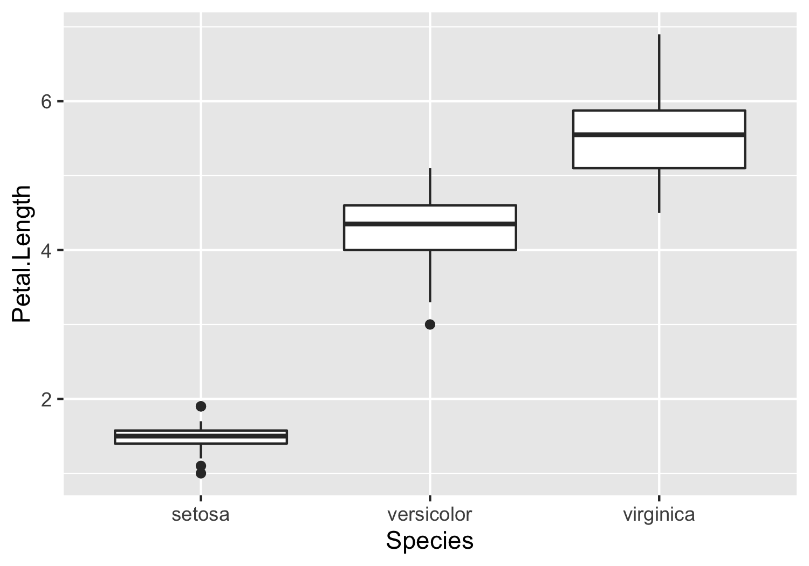

```{r setup, include=FALSE}
knitr::opts_chunk$set(echo = TRUE)
```


Recorded lecture: <a href="https://www.dropbox.com/s/2nicui696ypo3c7/zoom_1.mp4?dl=0" > <i class="fa fa-video-camera"></i> </a>

Rmarkdown: <a href="https://raw.githubusercontent.com/rnabioco/cellar/master/prerequisite.Rmd" style="text-decoration: none;"> <i class="fa fa-file-code-o"></i> </a> 

 
This Rmarkdown document contains a series of exercises related to some R programming concepts that will be used in the workshop. After writing and executing your code please try to `knit` the Rmarkdown using the `Knit` button. We will review the answers to these questions in the pre-workshop class on Monday. 

1) Use the `library()` function to load the tidyverse package. 

```{r}
library(tidyverse)
```


2) `mtcars` is a built-in dataset that is always loaded when R is started. The data.frame contains information on various vehicles (run `?mtcars` in the console for a description via the help tab). Please print the first 5 rows of the data.frame

```{r}
mtcars[1:5, ]
```


3)  Assign the `mtcars` dataset to a new variable. Name the variable whatever you would like. Please print the first 5 rows of the new data.frame.  

```{r}
new_df <- mtcars
new_df[1:5, ]
```

4) Select the `mpg` column from the `mtcars` data.frame and print the first 5 values of this vector of `mpg` values.  

```{r}
mtcars$mpg[1:5]
mtcars[1:5, "mpg"]
mtcars[["mpg"]][1:5]
pull(mtcars, "mpg")[1:5]
```

5) What type is the mpg vector (logical, character, integer, numeric, factor) ?

```{r}
class(mtcars$mpg)
typeof(mtcars$mpg)
```

6) Using the code below, add the `new_info` vector to the `mtcars` data.frame so that it is now the last column in your data.frame. Print the first 5 rows of the new data.frame. Assign the data.frame to a new variable if you would like but it is not necessary.

```{r}
new_info <- 1:nrow(mtcars)

mtcars$new_column <- new_info

mtcars <- mutate(mtcars, another_new_column = new_info)
mtcars[1:5, 10:12]
```

7) Using the code below, subset the `example_matrix` to a smaller matrix containing only rows 5 through 10 and columns 2 through 4. 

```{r}
example_matrix <- matrix(1:50, nrow = 10, ncol = 5)

example_matrix[5:10, 2:4]
```

8) The pipe operator (`%>%`) is a frequently used shortcut in the tidyverse. The pipe operator allows you to pipe data from one command to the next. See the [documentation](https://magrittr.tidyverse.org/reference/pipe.html#examples) for some examples. 

Please use the pipe operator to pipe the `mtcars` data.frame to the `head()` command

```{r}
mtcars %>% head()
```

9) Another builtin dataset in R is called `iris` which contains information about various iris species. (run `?iris` in the console for a description via the help tab). Please use `ggplot` (part of the tidyverse) to generate a boxplot comparing the `Petal.Length` across different species. Your plot should look similar to the plot shown below. 

{width=50%}
```{r}
ggplot(iris, aes(Species, Petal.Length)) + 
  geom_boxplot()
```


10) Most computing systems have a concept of a working directory, which is the directory (e.g. /cloud/project/) where the R process (or other language) is currently associated. This is important because when specifying paths to files (e.g. /cloud/project/example_plot.png), the R process will interpret the path relative to the current working directory. For example if your working directory is `/cloud/project` then you can specify `.Rhistory` rather than `/cloud/project/.Rhistory` to refer to the file. 

In Rstudio there is a difference between the working directory of the RMarkdown and the working directory of the console. The working directory of the Rmarkdown will always be the same directory where the R markdown is placed. The working direcotry of the console will in general be the same as the directory where the `.Rproj` file is placed. 

To illustrate please run the following in the R markdown (e.g. hit the green play button). 

```{r, eval = FALSE}
getwd()
```

Next type and run the same command in the console. What do you notice?

In general it is good practice to set the console working directory to the same directory as the Rmarkdown. This reduces confusion and makes it easier to run commands interactively. 

Please use the `setwd()` function to set the working directory of the console to the same as the Rmarkdown. You'll know this is successful because the path shown beneath the Console tab will be the same as the Rmarkdown path returned by running `getwd()` in the Rmarkdown.

11) R packages generally have extensive documentation to explain the purpose of each function and how to execute each function. The documentation can be queried using the `Help` tab. Alternatively you can use the `?` operator to pull up the documentation for specific functions. (e.g. `?sum`). Most functions will describe the arguments for the function and provide example code at the bottom of the documentation that can be copied and run in the console (or R markdown). 

One of the packages that we will be using for single cell analysis is `Seurat`. We will use the built-in documentation to teach use how to run a command. First load the Seurat package, then examine the documentation for `VlnPlot`. Copy the code from one of the examples in the documentation and run in the rmarkdown chunk below. 

google or related search engines can also be used to find documentation online for functions (e.g. search for Seurat VlnPlot).

```{r}
library(Seurat)
VlnPlot(object = pbmc_small, features = 'LYZ', split.by = 'groups')
```
